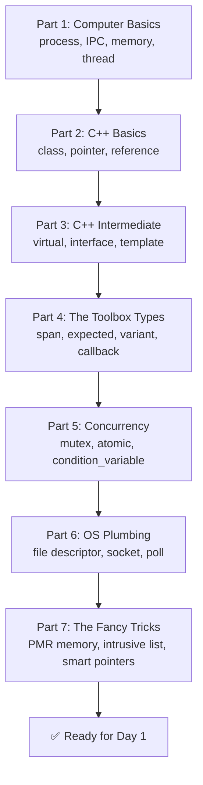

# 🧱 Day 0 — The Prerequisites Primer (Start HERE if you're a beginner)

> **Read this BEFORE Day 1 of the [READING_PLAN.md](READING_PLAN.md).**
>
> The `message_passing` code uses many C++ and operating-system ideas. If you only have
> **basic computer knowledge**, this file is your missing bottom step. It teaches *just enough*
> of each idea — in plain words, with tiny examples — so that Day 1 actually makes sense.
>
> You do **not** need to become an expert. You need to **recognize** each idea when you see it.
> Every concept here links to the **real place in the module** where you'll meet it, so the
> learning feels connected, not abstract.
>
> ⏱️ **Time budget: 1–2 days (5–10 hours).** Take it slow. This is the foundation.

---

## 🗺️ What you'll learn today (the shopping list)



> 💡 **How to read this file:** Read a section, then look at the linked code line. Don't try to
> *understand the whole code line* — just find the words you just learned inside it. That's the win.

---

# Part 1 — Computer Basics (the ground floor)

### 1.1 What is a **program** vs a **process**?
- A **program** is a file on disk (like a recipe 📄).
- A **process** is that program **running** in memory (the chef actually cooking 👨‍🍳).
- Your computer runs **many processes at once** (browser, music, this editor).

### 1.2 What is **IPC** (Inter-Process Communication)?
Two separate processes can't just read each other's memory — the operating system keeps them
in separate rooms for safety. **IPC** is any official way to pass messages between those rooms.

👉 **This entire module IS an IPC system.** That's the whole point.
> 📌 See it: [../i_client_connection.h](../i_client_connection.h#L24-L25) literally says
> *"asynchronous client-server IPC communication."*

**Real-world analogy:** Two houses (processes) can't walk into each other, so they send letters
through a **post office** (the IPC system). This module is that post office.

### 1.3 What is **memory (RAM)** and why do we care about "allocating" it?
- **RAM** is the computer's short-term workspace. Programs ask the OS for chunks of it.
- **"Allocating memory"** = asking for a new chunk (e.g., `new` in C++, or `malloc` in C).
- Allocating is **slow and can fail**. In a **car's safety software**, a surprise failure is
  dangerous. So this module tries to allocate everything **once at startup** and never again.

👉 Remember this theme: **"no allocation after startup."** It explains half the clever code.
> 📌 See it: [../client_connection.h](../client_connection.h#L108-L118) — *"we have no extra
> memory allocation after creation."*

### 1.4 What is a **thread**?
- A process can do several things **at the same time** using **threads** — like one chef with
  several pairs of hands.
- One thread can wait for a letter while another cooks. This module uses a **background thread**
  to watch for incoming messages so your main code isn't frozen.
> 📌 See it: [../unix_domain/unix_domain_engine.h](../unix_domain/unix_domain_engine.h#L134) —
> `std::thread thread_;`

### 1.5 **Synchronous vs Asynchronous** (super important word pair)
- **Synchronous / blocking** = "I wait right here until it's done." (Standing at the microwave.)
- **Asynchronous / non-blocking** = "Start it, walk away, get notified when done." (Set microwave,
  go watch TV, come back when it beeps.)

👉 The module offers both styles. `SendWaitReply` = synchronous. `SendWithCallback` = asynchronous.
> 📌 See it: [../i_client_connection.h](../i_client_connection.h#L64) says *"The call is blocking"*
> for `SendWaitReply`.

---

# Part 2 — C++ Basics (the language this module is written in)

> If you've done a *little* C, C++, Java, or even Python, this will feel familiar. Go slow.

### 2.1 A **class** = a blueprint that bundles data + functions
```cpp
class Dog {
  public:
    void Bark();      // a function (behavior)
  private:
    int age_;         // data (state)
};
```
- `public:` = anyone can use these. `private:` = only the class itself can.
- The whole module is built from classes.
> 📌 See a real one: [../client_connection.h](../client_connection.h#L30) — `class ClientConnection`.

### 2.2 **Object** = one actual thing built from the class blueprint
`Dog rex;` makes one dog. `ClientConnection conn;` makes one connection.

### 2.3 **Pointer** and **Reference** (how C++ points at things)
- A **pointer** (`Dog* p`) holds the **address** of an object. Can be `nullptr` (points at nothing).
- A **reference** (`Dog& r`) is a **nickname** for an existing object. Cannot be null.
- `->` uses a pointer's members (`p->Bark()`); `.` uses a reference/object (`r.Bark()`).

👉 You'll see `&` and `*` everywhere. Just read `&` as "reference to" and `*` as "pointer to."
> 📌 See it: [../i_server_connection.h](../i_server_connection.h#L36) returns
> `const ClientIdentity&` — a reference.

### 2.4 **const** = "promise not to change this"
`const` means read-only. `void Send(span<const uint8_t> msg)` promises not to modify `msg`.
It's a **safety label**, very common in this codebase.

### 2.5 **Header (.h) vs Source (.cpp)**
- **`.h` (header)** = the *menu* — declares what exists (function names, class shapes).
- **`.cpp` (source)** = the *kitchen* — the actual code that does the work.
- The reading plan reads `.h` first (what) then `.cpp` (how). That's why.

### 2.6 **namespace** = a folder for names (avoids clashes)
`score::message_passing::ClientConnection` means "the `ClientConnection` inside the
`message_passing` inside `score`." The `::` is just "inside."

---

# Part 3 — C++ Intermediate (the ideas that unlock this module)

### 3.1 **Inheritance** = "is a kind of"
A `Cat` **is a kind of** `Animal`, so it inherits `Animal`'s features.
```cpp
class Animal { public: void Eat(); };
class Cat : public Animal { };   // Cat now also has Eat()
```

### 3.2 **Virtual function** = "child can replace this behavior"
`virtual` lets a child class provide its own version. This is how the same call does different
things depending on the real object.
```cpp
class Animal { public: virtual void Speak(); };
class Cat : public Animal { public: void Speak() override; };  // Cat says "Meow"
```

### 3.3 **Pure virtual (`= 0`) and Interfaces** ⭐ (the MOST important idea here)
A function ending in `= 0` has **no body** — it's a **pure promise**. A class full of these is an
**interface**: it says *"whoever implements me must provide these functions"* but does none itself.

```cpp
class IClientConnection {
  public:
    virtual void Send(...) = 0;   // "You MUST provide Send. I won't."
};
```

- In this module, **every file starting with `i_`** is an interface (`i_` = interface).
- The real classes (like `ClientConnection`) **fill in** those promises.
- **Why?** So your code talks to `IClientConnection` and doesn't care whether it's really the
  Linux version or the QNX version underneath. Swap the engine, same code. This is the
  module's #1 design idea.
> 📌 See it: [../i_client_connection.h](../i_client_connection.h#L59-L60) has
> `virtual ... Send(...) = 0;` and [../client_connection.h](../client_connection.h#L30) shows
> `ClientConnection final : public IClientConnection` **fulfilling** that promise.

### 3.4 **Factory** = "a machine that builds objects for you"
Instead of building a connection yourself, you ask a **factory** to build one. The factory
decides the exact type (Linux or QNX) and hands you back the interface.
> 📌 See it: [../i_client_factory.h](../i_client_factory.h#L68-L69) — `Create(...)` returns a
> `unique_ptr<IClientConnection>`.

### 3.5 **Template** = "a blueprint with a blank to fill in"
A template works for **any type**. `std::vector<int>` is a vector of ints; `std::vector<Dog>` a
vector of dogs — same code, different fill-in.
```cpp
template <typename T>
class Box { T item; };   // Box<int>, Box<Dog>, ...
```
👉 You'll see `<...>` a lot. It just means "with this type plugged in." Don't panic at it.

### 3.6 **Enum (enumeration)** = a fixed list of named choices
```cpp
enum class State { kStarting, kReady, kStopping, kStopped };
```
Much safer than using numbers 0,1,2,3. The connection's life is described by an enum like this.
> 📌 See it: [../i_client_connection.h](../i_client_connection.h#L100-L106).

---

# Part 4 — The Toolbox Types (special types you'll meet constantly)

These come from the `score::cpp` helper library. Learn what each *means*; you don't need their guts.

### 4.1 `span` — a safe "window" into some bytes (no copying)
A `span<const uint8_t>` says: "here's a view of some bytes — where they start and how many."
It does **not** copy the data; it just points at it. Fast and safe.
> 📌 See it: [../i_client_connection.h](../i_client_connection.h#L59-L60).
> **Analogy:** a span is like a *bookmark range* — "pages 10 to 20 of that book," without
> photocopying the pages.

### 4.2 `expected` — "either a result OR an error" (no exceptions)
Instead of throwing errors, functions return an `expected`: it either holds the value you wanted,
or an error explaining what went wrong. You check which one you got.
- `expected<Value, Error>` = success value or error.
- `expected_blank<Error>` = "worked (nothing to return)" or error.
> 📌 See it: [../i_client_connection.h](../i_client_connection.h#L59-L60) returns
> `expected_blank<score::os::Error>`.
> **Analogy:** a scratch-off lottery ticket — underneath is *either* a prize *or* "try again."

### 4.3 `variant` — "one box that can hold one of several types"
`variant<void*, uintptr_t, unique_ptr<IConnectionHandler>>` means the box holds **exactly one**
of those three things at a time. The `UserData` you attach to a connection is a variant.
> 📌 See it: [../server_types.h](../server_types.h#L25).
> **Analogy:** a single drawer that today holds a spoon, tomorrow a fork — one thing at a time.

### 4.4 `callback` — "a function you hand over to be called later"
A **callback** is a function packaged as a value, so someone else can call it when an event
happens ("call me back when the reply arrives"). This is the heart of *asynchronous* code.
> 📌 See it: [../i_client_connection.h](../i_client_connection.h#L71-L73) — `ReplyCallback`.
> **Analogy:** leaving your phone number at a shop so they **call you** when your order is ready,
> instead of you standing there waiting.

### 4.5 `string_view` — a read-only peek at a piece of text
Like `span`, but for text. It looks at characters without copying them.
> 📌 See it: [../service_protocol_config.h](../service_protocol_config.h#L27) — `identifier`.

---

# Part 5 — Concurrency (many things at once, safely)

When a background thread and your thread touch the **same data**, chaos can happen. These tools
prevent that.

### 5.1 **Race condition** = the bug we're avoiding
Two threads change the same thing at the same moment → corrupted, unpredictable result. Like two
people editing the same sentence simultaneously.

### 5.2 `mutex` = a "talking stick" 🪅
Only the thread holding the mutex may touch the protected data. Others wait their turn. This
serializes access so there's no race.
> 📌 See it: [../client_connection.h](../client_connection.h#L120) — `std::mutex send_mutex_;`

### 5.3 `condition_variable` = a "wake me when ready" bell 🔔
A thread can **sleep** on a condition_variable and another thread **rings the bell** to wake it.
Used with a mutex. This is how "wait for a reply" is implemented efficiently (sleep instead of
busy-spinning).
> 📌 See it: [../client_connection.h](../client_connection.h#L121) — `std::condition_variable send_condition_;`

### 5.4 `atomic` = a variable that's safe to touch from many threads
A normal variable read by two threads at once can tear. An `atomic<State>` is guaranteed to be
read/written cleanly, no mutex needed for that single value.
> 📌 See it: [../client_connection.h](../client_connection.h#L91-L92) — `std::atomic<State> state_;`

### 5.5 The **"callback thread"** idea
This module runs your event callbacks on **one specific background thread**, so they happen **in
order**. Some code needs to ask "am I currently on that thread?" to avoid deadlocks (a thread
waiting for itself).
> 📌 See it: [../unix_domain/unix_domain_engine.h](../unix_domain/unix_domain_engine.h#L112-L115)
> — `IsOnCallbackThread()`.

---

# Part 6 — Operating-System Plumbing (how messages really move)

### 6.1 **File descriptor (fd)** = a numbered handle to something you can read/write
In Unix/Linux, **everything is a "file"** — real files, sockets, pipes. The OS gives you a small
integer (an **fd**, e.g. `3`) as a ticket to that thing. You read/write using the number.
> 📌 See it: [../client_connection.h](../client_connection.h#L90) — `std::int32_t client_fd_;`
> **Analogy:** a **coat-check number** 🎫 — the number isn't your coat, but it lets you get to it.

### 6.2 **Socket** = a two-way pipe between two programs
A **Unix domain socket** is a fast pipe between two processes **on the same machine**. This is
the Linux transport this module uses. The server creates a **named** socket; clients connect to
that name.
> 📌 See it: the Linux engine folder [../unix_domain/](../unix_domain/) is built around this.

### 6.3 **poll loop** = "watch many fds, tell me which one has news"
Instead of checking each fd one by one, `poll()` lets the background thread **sleep** until *any*
watched fd has data, then wakes and handles it. This is the engine's core loop.
> 📌 See it: [../unix_domain/unix_domain_engine.h](../unix_domain/unix_domain_engine.h#L140) —
> `poll_fds_`, and `RunOnThread()` is the loop.
> **Analogy:** a receptionist watching many phone lines 📞 — sleeps until *one* rings, answers it,
> goes back to sleep.

### 6.4 **QNX** = a different operating system used in real cars
QNX is a **safety-certified** OS. Instead of Unix sockets it uses its own tools:
**Channels, Pulses, and a "Resource Manager"** (a QNX way to make a named service). Same *idea*
as the Linux side, different plumbing. You only need to skim this unless you deploy to QNX.
> 📌 See it: [../qnx_dispatch/qnx_dispatch_engine.h](../qnx_dispatch/qnx_dispatch_engine.h#L86-L167).

---

# Part 7 — The Fancy Tricks (why the code looks unusual)

### 7.1 **PMR / `memory_resource` / `polymorphic_allocator`** = "control where memory comes from"
Normally C++ grabs memory from the global heap. **PMR** lets you say "get memory from *this*
specific pool instead." The engine owns a `memory_resource` and hands it out, so all memory is
**controlled and predictable** (remember Part 1.3 — the safety theme).
> 📌 See it: [../i_shared_resource_engine.h](../i_shared_resource_engine.h#L39) —
> `GetMemoryResource()`. The `score::cpp::pmr::` types you see are all "use the controlled pool."
> **Analogy:** instead of every worker grabbing supplies from a giant chaotic warehouse, they all
> draw from **one organized cart** you can track and refill.

### 7.2 **`unique_ptr`** = a smart pointer that auto-cleans up
A `unique_ptr<Dog>` owns a Dog and **automatically deletes** it when done — no manual `delete`,
no memory leaks. Only **one** owner at a time.
> 📌 See it: [../i_client_factory.h](../i_client_factory.h#L68-L69) returns a `unique_ptr`.

### 7.3 **`shared_ptr`** = a smart pointer that's shared and counted
A `shared_ptr` lets **several** owners share one object; it's deleted only when the **last** owner
lets go. The **Engine** is shared this way among factories, servers, and connections.
> 📌 See it: [../unix_domain/unix_domain_engine.h](../unix_domain/unix_domain_engine.h#L38-L41)
> — *"shared via std::shared_ptr."*
> **Analogy:** a shared Netflix account — it stays active while *anyone* is still using it.

### 7.4 **Intrusive list** = a linked list that needs **zero** allocation ⭐
A normal list allocates a little box for each item you add. An **intrusive list** flips it: the
**item itself contains** the "next/prev" links, so adding it to a list allocates **nothing**.
This is how the module queues messages and timers without ever hitting the heap (Part 1.3 again!).
> 📌 See it: [../client_connection.h](../client_connection.h#L108-L132) — the `send_pool_` /
> `send_queue_` trick, and [../timed_command_queue_entry.h](../timed_command_queue_entry.h#L27)
> where the entry *is* a list node.
> **Analogy:** instead of buying a separate folder for each paper, each paper has its own built-in
> hook and clips directly onto the rail. No folders to buy.

### 7.5 **`noexcept`** = "this function promises not to throw errors"
You'll see `noexcept` on almost every function. It's a promise about behavior (fits the "no
exceptions, use `expected` instead" style from Part 4.2). Just read it as "won't throw."

---

## 🧠 The ONE theme that ties it all together

Almost every "weird" thing in this module exists for **one reason**:

> ### 🎯 *"Be safe and predictable — never surprise-allocate memory or freeze."*

| Trick you learned | Serves the theme by… |
| --- | --- |
| PMR memory resource (7.1) | Controlling exactly where memory comes from |
| Intrusive lists (7.4) | Queuing with **zero** allocation |
| Pre-allocated send pool | Allocating once at startup, never again |
| `expected` instead of exceptions (4.2) | Predictable errors, no hidden jumps |
| Interfaces + factory (3.3, 3.4) | Same safe code on Linux **and** QNX |
| One callback thread + mutex/atomic (5) | Ordered, race-free behavior |

If you remember this one sentence, the whole codebase stops looking random.

---

## ✅ "Am I Ready for Day 1?" Self-Check

Answer these **in your own words**. If you can, start [READING_PLAN.md](READING_PLAN.md) Day 1.
If one stumps you, re-read that Part above (number in brackets).

1. What's the difference between a **program** and a **process**? What is **IPC**? *(1.1, 1.2)*
2. Why does this module avoid **allocating memory** after startup? *(1.3)*
3. What's the difference between **synchronous** and **asynchronous**? *(1.5)*
4. What does a class with functions ending in `= 0` mean? Why are files named `i_*`? *(3.3)*
5. What is a **factory** and why use one? *(3.4)*
6. In one line each: what are `span`, `expected`, `variant`, and `callback`? *(4.1–4.4)*
7. What problem do `mutex`, `atomic`, and `condition_variable` solve? *(5.1–5.4)*
8. What is a **file descriptor**? What is a **socket**? What does a **poll loop** do? *(6.1–6.3)*
9. What's the difference between `unique_ptr` and `shared_ptr`? *(7.2, 7.3)*
10. Why does the code use **intrusive lists** and **PMR memory**? *(7.1, 7.4)*
11. **The big one:** State the single theme that explains most of the module's design. *(the theme box)*

> 🎉 If you can answer all 11, you have the foundation. Head to
> **[READING_PLAN.md](READING_PLAN.md) → Day 1** and begin the real journey.

---

## 🧪 Day 0 — Tough MCQ Test (pick ONE best answer)
> Pass mark: **12/15**. If you fail, re-read the Part in brackets, then retry.

**Q1.** A **process** is: *(1.1)*
- A) A file sitting on disk
- B) A program actually running in memory
- C) A CPU core
- D) A folder

**Q2.** **IPC** stands for and means: *(1.2)*
- A) Internal Program Cache
- B) Inter-Process Communication — passing messages between separate processes
- C) Instruction Pointer Counter
- D) Integrated Peripheral Controller

**Q3.** The module avoids allocating memory after startup mainly because: *(1.3)*
- A) It's illegal in C++
- B) Runtime allocation can be slow/fail — dangerous in safety-critical software
- C) It saves disk space
- D) It makes code shorter

**Q4.** **Synchronous (blocking)** means: *(1.5)*
- A) Start it and walk away
- B) Wait right here until it's done
- C) It never finishes
- D) It runs on another machine

**Q5.** A class method ending in `= 0` (pure virtual) means: *(3.3)*
- A) It returns zero
- B) It has no body — implementers MUST provide it (an interface)
- C) It is private
- D) It is deleted

**Q6.** Files named `i_*` in this module are: *(3.3)*
- A) Interfaces (pure contracts)
- B) Implementation files
- C) Test files
- D) Image files

**Q7.** A **factory** is used to: *(3.4)*
- A) Delete objects
- B) Build objects for you and return them via an interface
- C) Log messages
- D) Open sockets

**Q8.** A `span<const uint8_t>` is: *(4.1)*
- A) A deep copy of bytes
- B) A non-owning view (pointer + length) of bytes
- C) A thread
- D) An error type

**Q9.** `expected<Value, Error>` lets a function: *(4.2)*
- A) Throw exceptions
- B) Return either a value or an error, no exceptions
- C) Return two values always
- D) Block

**Q10.** A `variant<A,B,C>` holds: *(4.3)*
- A) All of A, B, C at once
- B) Exactly one of A, B, or C at a time
- C) None ever
- D) Only pointers

**Q11.** A **callback** is: *(4.4)*
- A) A returned error code
- B) A function handed over to be called later when an event happens
- C) A memory pool
- D) A socket number

**Q12.** A **mutex** solves: *(5.2)*
- A) Slow networking
- B) Two threads corrupting shared data (race conditions)
- C) Memory leaks
- D) File size

**Q13.** An `atomic<State>` variable is: *(5.4)*
- A) Safe to read/write from multiple threads without tearing
- B) Always const
- C) A kind of socket
- D) A logger

**Q14.** A **file descriptor** is: *(6.1)*
- A) A password
- B) A small integer handle to something you can read/write (file, socket, pipe)
- C) A thread id
- D) A class name

**Q15.** `unique_ptr` vs `shared_ptr`: *(7.2, 7.3)*
- A) Both allow many owners
- B) `unique_ptr` = one owner; `shared_ptr` = many owners, freed when the last releases
- C) `shared_ptr` = one owner only
- D) They are identical

<details><summary>🔑 Day 0 Answer Key</summary>

1-B · 2-B · 3-B · 4-B · 5-B · 6-A · 7-B · 8-B · 9-B · 10-B · 11-B · 12-B · 13-A · 14-B · 15-B
</details>

---

## 📚 Where to go deeper (optional, only if a concept won't click)

You do **not** need these to start — only if something stays fuzzy:
- **C++ classes, pointers, virtual functions:** any beginner C++ tutorial (search
  "C++ classes and inheritance basics").
- **Threads & mutex:** search "C++ std::thread and std::mutex beginner."
- **Sockets & file descriptors:** search "Unix domain socket explained simply."
- **Everything else** is explained enough right here — trust the analogies and the code links.
