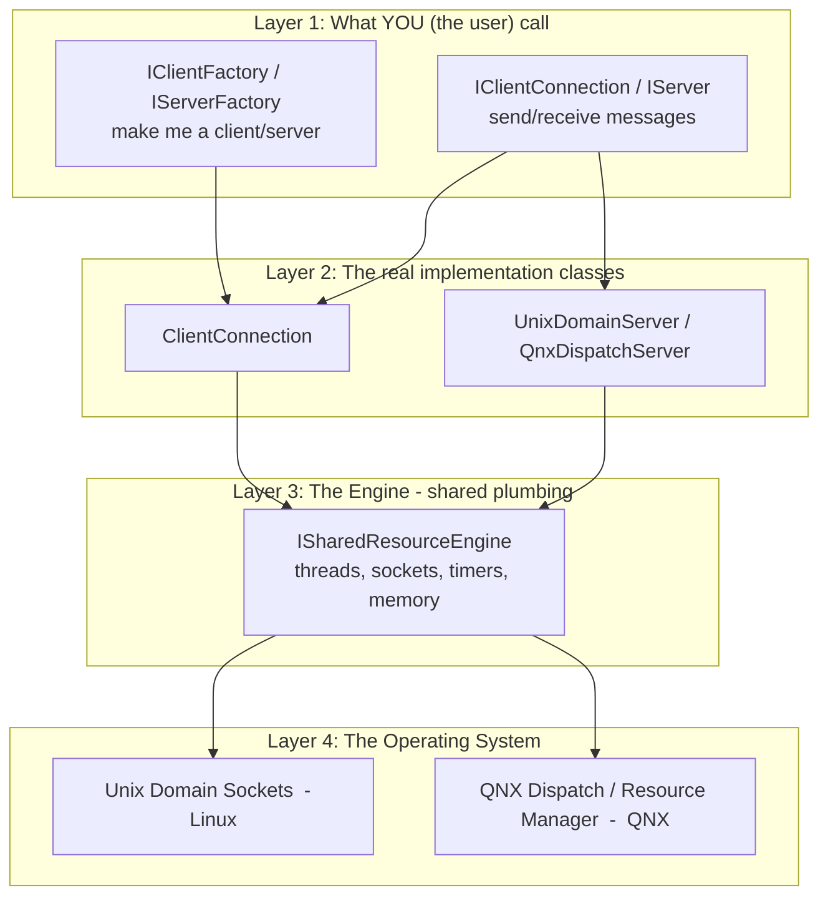
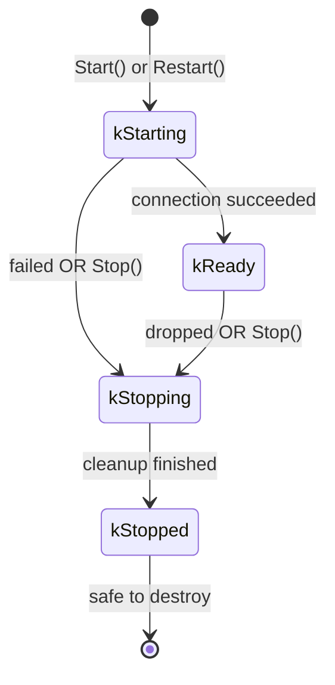
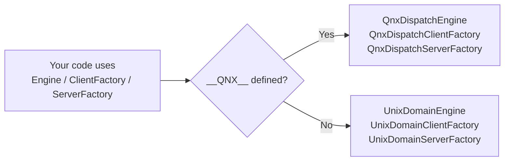
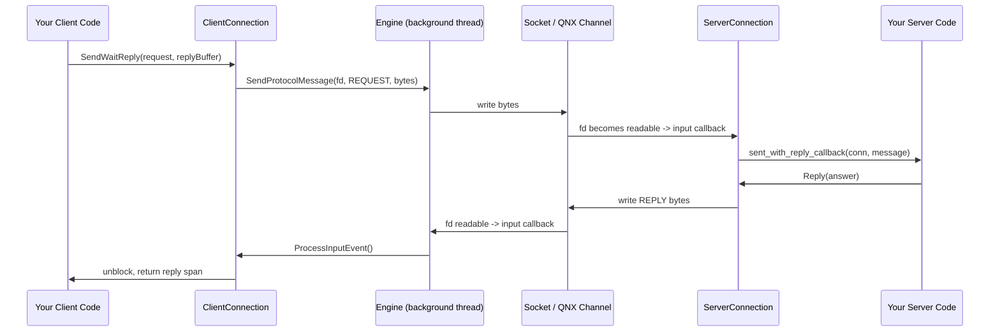

# Message Passing — The One-Stop Learning Guide 📬

> **Who is this for?** A brand-new coder joining the `score::message_passing` module.
> **Goal:** After reading this, you should understand *what* every file does, *why* it exists,
> and *how* the pieces fit together — with **proof in the actual code** for every claim.
>
> Every claim below links to the real file and line so you can verify it yourself.
> Nothing here is invented; if it's stated, it's in the code.

---

## 🧭 START HERE — Read this box before anything else

**This guide is your home base. You navigate to the other two files from here.** There are three
files in this `onboarding/` folder, and they have different jobs:

| File | Its job | When you use it |
| --- | --- | --- |
| **📘 LEARNING_GUIDE.md** *(you are here)* | The **reference book** — explains every concept with code proof | Always open. Your home base. |
| **🧱 [DAY_0_PREREQUISITES.md](DAY_0_PREREQUISITES.md)** | Teaches the **basic C++ / computer concepts** the code assumes | **First**, if you're a beginner |
| **🗓️ [READING_PLAN.md](READING_PLAN.md)** | The **day-by-day, hour-by-hour** schedule of what to read | Every day, to know what to do next |

### 👉 Which path are you on? Pick one:

- **🟢 I have only basic computer knowledge** (not yet comfortable with C++ classes, pointers,
  threads, sockets):
  **Step 1:** Read [DAY_0_PREREQUISITES.md](DAY_0_PREREQUISITES.md) fully and pass its 11-question
  self-check.
  **Step 2:** Come back and read [§1](#1-the-10-year-old-explanation-start-here),
  [§2](#2-the-big-picture-mental-model), [§3](#3-the-core-vocabulary) of this guide.
  **Step 3:** Follow [READING_PLAN.md](READING_PLAN.md) day by day, using this guide as your
  reference whenever the plan says *"read guide §X"*.

- **🔵 I already know intermediate C++ and basic OS ideas:**
  Skip Day 0. Read [§1–§4](#1-the-10-year-old-explanation-start-here) here, then jump straight
  into [READING_PLAN.md](READING_PLAN.md) → Day 1.

> ⚠️ **Do not try to read this whole guide top-to-bottom as your only step.** Sections 4+ quote
> **real code** full of concepts taught in Day 0. Without that foundation you'll get stuck. The
> guide is meant to be read *alongside* the Reading Plan, not instead of it.

---

## Table of Contents

1. [The 10-Year-Old Explanation (Start Here)](#1-the-10-year-old-explanation-start-here)
2. [The Big Picture (Mental Model)](#2-the-big-picture-mental-model)
3. [The Core Vocabulary](#3-the-core-vocabulary)
4. [The Public Interfaces (The "Contracts")](#4-the-public-interfaces-the-contracts)
5. [The Two Worlds: QNX vs Linux](#5-the-two-worlds-qnx-vs-linux)
6. [The Engine — The Beating Heart](#6-the-engine--the-beating-heart)
7. [The Client Side — Step by Step](#7-the-client-side--step-by-step)
8. [The Server Side — Step by Step](#8-the-server-side--step-by-step)
9. [Supporting Tools (Queue, Future, Log)](#9-supporting-tools-queue-future-log)
10. [How a Message Actually Travels (Full Flow)](#10-how-a-message-actually-travels-full-flow)
11. [Revision Notes (Quick Cheat Sheet)](#11-revision-notes-quick-cheat-sheet)
12. [Line-by-Line Reading Plan (Day-by-Day, 5 hrs/day)](#12-line-by-line-reading-plan-day-by-day-5-hrsday)

---

## 1. The 10-Year-Old Explanation (Start Here)

Imagine two people who live in **different houses** (two programs running on the same
computer). They can't shout across the street — they need a way to pass notes.

- One person is the **Server** 🏠 — they set up a **mailbox** with a name on it and wait.
- The other is the **Client** ✉️ — they find that named mailbox and drop notes in it.

This module is the **postal system** that makes that possible. It gives you:

- A way for the server to **open a named mailbox** (`StartListening`).
- A way for the client to **find and connect to that mailbox** (`Start`).
- Three ways to send notes:
  - **"Fire and forget"** — drop a note, walk away, don't wait for a reply → `Send`.
  - **"Wait for the answer"** — drop a note and stand there until you get a reply back → `SendWaitReply`.
  - **"Call me back later"** — drop a note, go do other things, and the postman taps you on the shoulder when the reply arrives → `SendWithCallback`.
- The server can also **push a note to the client without being asked** (like a "You've got mail!" alert) → `Notify`.

**Why does this exist at all?** Because in a car 🚗 (this is automotive safety software!),
many small programs must talk to each other *safely, quickly, and predictably* — without
crashing, without leaking memory, and without freezing. A normal "just use the network"
approach is too slow and unpredictable. So this module builds a **custom, careful,
memory-safe postal service**.

> 📌 **Proof this is IPC (Inter-Process Communication):**
> The interface literally says so — *"providing the client side of asynchronous client-server
> IPC communication"* in [i_client_connection.h](../i_client_connection.h#L24-L25).

---

## 2. The Big Picture (Mental Model)

Think of the module in **4 layers**, like a cake 🎂:



**The golden rule to remember:** *Interfaces on top (names starting with `I`), real
implementations in the middle, one shared Engine underneath doing the hard OS work.*

**Why this shape?** This is the **Factory + Interface (Dependency Inversion)** pattern.
Your business code only ever talks to `I...` interfaces, so the *same* code works on both
Linux and QNX. Only the factory decides which real class gets built.

> 📌 **Proof the interface/implementation split is real:**
> `ClientConnection` is declared `final : public IClientConnection` in
> [client_connection.h](../client_connection.h#L30). It *implements* the interface.

> 📌 **Proof the factory returns the interface, not the concrete type:**
> `Create(...)` returns `score::cpp::pmr::unique_ptr<IClientConnection>` in
> [i_client_factory.h](../i_client_factory.h#L68-L69) — the caller never sees the real class.

---

## 3. The Core Vocabulary

Learn these 8 words and 80% of the module makes sense. Every one is backed by code.

| Word | Kid-friendly meaning | Real code |
| --- | --- | --- |
| **Client** | The one who sends notes and asks questions | [i_client_connection.h](../i_client_connection.h#L26) |
| **Server** | The one with the named mailbox who answers | [i_server.h](../i_server.h#L26) |
| **Connection** | One open "phone line" between a client and server | [i_server_connection.h](../i_server_connection.h#L26) |
| **Factory** | A machine that builds clients or servers for you | [i_client_factory.h](../i_client_factory.h#L30) |
| **Engine** | The shared engine room: threads, sockets, timers | [i_shared_resource_engine.h](../i_shared_resource_engine.h#L28) |
| **Callback** | "Tap me on the shoulder when X happens" | `ReplyCallback` in [i_client_connection.h](../i_client_connection.h#L71-L73) |
| **State** | What phase the connection is in right now | `enum class State` in [i_client_connection.h](../i_client_connection.h#L100-L106) |
| **Span** | A safe "window" into a block of bytes (no copying) | `score::cpp::span<const std::uint8_t>` in [i_client_connection.h](../i_client_connection.h#L59-L60) |

### The four connection States (memorize the diagram!)



> 📌 **Proof — this exact diagram is in the code comments:**
> [i_client_connection.h](../i_client_connection.h#L88-L98) describes the transitions, and the
> `enum class State` lists `kStarting, kReady, kStopping, kStopped` at
> [i_client_connection.h](../i_client_connection.h#L100-L106).

**Why states matter:** You can only safely *destroy* a connection when it is `kStopped`.
The comment warns: *"It is unsafe to destruct the connection that is not in the Stopped state"*
— [i_client_connection.h](../i_client_connection.h#L30-L33). This prevents crashes from
destroying something while a background thread is still using it.

---

## 4. The Public Interfaces (The "Contracts")

These are pure interfaces (all methods `= 0`). They are **promises**: "any real class here
will provide these functions." This is the part *you* code against.

### 4.1 `IClientConnection` — the client's remote control

Three ways to send, plus lifecycle controls:

| Method | What it does | Blocking? | Proof |
| --- | --- | --- | --- |
| `Send` | Fire-and-forget | Non-blocking | [i_client_connection.h](../i_client_connection.h#L59-L60) |
| `SendWaitReply` | Send and wait for the answer | **Blocking** | [i_client_connection.h](../i_client_connection.h#L68-L70) |
| `SendWithCallback` | Send, get called back later | Non-blocking | [i_client_connection.h](../i_client_connection.h#L82-L83) |
| `Start` | Open the connection | — | [i_client_connection.h](../i_client_connection.h#L152) |
| `Stop` | Close the connection | — | [i_client_connection.h](../i_client_connection.h#L155) |
| `Restart` | Try to reopen after a stop | — | [i_client_connection.h](../i_client_connection.h#L159) |

**Why three send methods?** Different needs: sometimes you don't care about the reply (fast),
sometimes you must have it before continuing (simple but blocks), sometimes you want the reply
*without* freezing your program (efficient but needs a callback). The docs explain each
trade-off inline, e.g. `SendWaitReply` *"The call is blocking"*
— [i_client_connection.h](../i_client_connection.h#L64).

### 4.2 `IServer` — the mailbox owner

Only two methods — a server is simpler than a client:

- `StartListening(...)` — open the named mailbox and register callbacks for connect /
  disconnect / message events. See [i_server.h](../i_server.h#L48-L53).
- `StopListening()` — close everything down. See [i_server.h](../i_server.h#L58).

**Why so few methods?** The server doesn't *initiate* — it *reacts*. All its work happens
inside the callbacks you give to `StartListening`. That's why the interface is tiny.

### 4.3 `IServerConnection` — one client's live session on the server

When a client connects, the server gets one of these per client. It can:

- `Reply(...)` — answer a request. [i_server_connection.h](../i_server_connection.h#L37-L38)
- `Notify(...)` — push an unsolicited message to the client. [i_server_connection.h](../i_server_connection.h#L39-L40)
- `RequestDisconnect()` — hang up. [i_server_connection.h](../i_server_connection.h#L41)
- `GetClientIdentity()` — find out **who** connected (pid/uid/gid). [i_server_connection.h](../i_server_connection.h#L36)

> 📌 **Proof of "who connected" security check:** `ClientIdentity` holds `pid`, `uid`, `gid`
> in [server_types.h](../server_types.h#L41-L49). This lets the server check permissions — a
> **safety/security feature** so a random process can't pretend to be trusted.

### 4.4 The callback types (defined in `server_types.h`)

The server tells you about events through 4 callback types:

- `ConnectCallback` — "a new client just connected" → [server_types.h](../server_types.h#L27-L28)
- `DisconnectCallback` — "a client left" → [server_types.h](../server_types.h#L30)
- `MessageCallback` — "a message arrived" (used for both `Send` and `SendWaitReply`) → [server_types.h](../server_types.h#L32-L34)

**Why callbacks instead of return values?** Because everything is **asynchronous** — events
happen on background threads at unpredictable times. You can't "return" a message that hasn't
arrived yet, so you leave a phone number (callback) instead.

### 4.5 `UserData` — attach your own object to a connection

The server lets you glue *your own* data to each connection using a `std::variant`:

```cpp
using UserData = std::variant<void*, std::uintptr_t,
                              score::cpp::pmr::unique_ptr<IConnectionHandler>>;
```

> 📌 **Proof:** [server_types.h](../server_types.h#L25). If you store an `IConnectionHandler`,
> the server calls *its* methods (`OnMessageSent`, etc.) instead of the shared callbacks —
> see [i_connection_handler.h](../i_connection_handler.h#L38-L45). This is the
> **object-oriented** way to handle a connection (each connection = one handler object).

---

## 5. The Two Worlds: QNX vs Linux

The same module runs on **two operating systems**, and it picks the right code at compile
time using `#ifdef __QNX__`.



> 📌 **Proof — the switch is literally there:**
> [engine.h](../engine.h#L16-L20) does `#ifdef __QNX__ ... #else ... #endif`, and
> [client_factory.h](../client_factory.h#L15-L36) picks `QnxDispatchClientFactory` vs
> `UnixDomainClientFactory` the same way.

**Why two implementations?**
- **Linux** uses **Unix Domain Sockets** — a standard, well-known local-communication tool.
  Great for development and testing on a normal PC.
- **QNX** uses its native **Dispatch / Resource Manager** system — faster and safety-certified,
  which is what actually ships in the car.

Both hide behind the *same* `ISharedResourceEngine` interface, so the client/server logic on
top doesn't know or care which OS it's on. **This is the whole point of the abstraction.**

---

## 6. The Engine — The Beating Heart

`ISharedResourceEngine` is the shared "engine room." One engine is shared (via
`std::shared_ptr`) by the factories, servers, and connections.

> 📌 **Proof it's meant to be shared:** the class doc says *"The class is supposed to be
> shared via std::shared_ptr between its consumers (client and server factories, server
> objects, client and server connections)"* — [unix_domain_engine.h](../unix_domain/unix_domain_engine.h#L38-L41).

### What the engine provides (its job list)

| Responsibility | Method | Proof |
| --- | --- | --- |
| Give out memory (no random heap use!) | `GetMemoryResource()` | [i_shared_resource_engine.h](../i_shared_resource_engine.h#L39) |
| Logging | `GetLogger()` | [i_shared_resource_engine.h](../i_shared_resource_engine.h#L41) |
| Open a connection to a server | `TryOpenClientConnection()` | [i_shared_resource_engine.h](../i_shared_resource_engine.h#L45-L46) |
| Send raw protocol bytes | `SendProtocolMessage()` | [i_shared_resource_engine.h](../i_shared_resource_engine.h#L50-L53) |
| Receive raw protocol bytes | `ReceiveProtocolMessage()` | [i_shared_resource_engine.h](../i_shared_resource_engine.h#L54-L56) |
| Schedule delayed work (timers) | `EnqueueCommand()` | [i_shared_resource_engine.h](../i_shared_resource_engine.h#L68-L71) |
| Watch a file descriptor for events | `RegisterPosixEndpoint()` | [i_shared_resource_engine.h](../i_shared_resource_engine.h#L88) |
| Clean up everything owned by X | `CleanUpOwner()` | [i_shared_resource_engine.h](../i_shared_resource_engine.h#L92) |

### The background thread (the "postman")

Each engine runs **one background thread** with a poll loop. It waits for events (a socket
became readable, a timer fired) and dispatches them.

> 📌 **Proof (Linux):** `UnixDomainEngine` has `std::thread thread_;` and a private
> `RunOnThread()` method — [unix_domain_engine.h](../unix_domain/unix_domain_engine.h#L134)
> and [unix_domain_engine.h](../unix_domain/unix_domain_engine.h#L128). It also holds a
> `poll_fds_` vector for the poll loop — [unix_domain_engine.h](../unix_domain/unix_domain_engine.h#L140).

**Why one background thread?** So all callbacks for a connection happen **in order**, on a
known thread, without you having to manage threads yourself. The `IsOnCallbackThread()` check
— [unix_domain_engine.h](../unix_domain/unix_domain_engine.h#L112-L115) — lets the code detect
"am I already on the postman's thread?" to avoid deadlocks.

### `PosixEndpointEntry` — "watch this file descriptor for me"

This little struct is how any part of the system says *"engine, please call me when this fd
has data."* It carries the fd plus callbacks: `input`, `ping`, `output`, `disconnect`.

> 📌 **Proof:** [i_shared_resource_engine.h](../i_shared_resource_engine.h#L74-L86). Note the
> comments: `input` = "Called when fd is ready to read", `disconnect` = "called when endpoint
> is deactivated."

---

## 7. The Client Side — Step by Step

The real client is `ClientConnection` (declared in
[client_connection.h](../client_connection.h#L30)). Let's dissect it.

### Its ingredients (member variables tell the story)

- `engine_` — the shared engine. [client_connection.h](../client_connection.h#L84)
- `state_` and `stop_reason_` — atomic, because multiple threads read them.
  [client_connection.h](../client_connection.h#L91-L92)
- `send_mutex_` + `send_condition_` — lock + wait-signal for coordinating sends.
  [client_connection.h](../client_connection.h#L120-L121)
- **The pre-allocated send pool** — this is the clever memory trick 👇

### The zero-allocation send pool (the smartest idea here)

At construction, the client **pre-allocates** storage for all the messages it will ever need
to queue. After that, sending a message never allocates heap memory.

> 📌 **Proof — read the comment, it explains itself:**
> [client_connection.h](../client_connection.h#L108-L118) says *"we preallocate the storage for
> the amount of messages requested... Thus, we have no extra memory allocation after creation
> of a ClientConnection object."* It uses two intrusive lists: `send_pool_` (free slots) and
> `send_queue_` (waiting messages) — [client_connection.h](../client_connection.h#L131-L132).

**Why?** In safety-critical car software, allocating memory at runtime is risky (it can fail
or be slow unpredictably). So the module allocates once up front and recycles.

### The `ClientConfig` knobs (behavior tuning)

> 📌 **Proof:** [i_client_factory.h](../i_client_factory.h#L44-L62)

| Knob | Meaning |
| --- | --- |
| `max_async_replies` | How many `SendWithCallback` can be in-flight at once |
| `max_queued_sends` | Size of the client-side send queue |
| `fully_ordered` | Keep all message types in strict order |
| `truly_async` | Always use the background thread for IPC |
| `sync_first_connect` | Do the first connect on the calling thread |

**Why so many knobs?** Different clients have different safety needs. For example, an **ASIL B
(safety) client talking to a QM (non-safety) server** only gets its non-blocking guarantee if
messages are queued (`max_queued_sends != 0`) — stated in
[i_client_connection.h](../i_client_connection.h#L53-L54). The knobs let you meet your exact
safety requirement.

### Client private helpers (the internal machine)

- `TryConnect()` — attempt to open the line. [client_connection.h](../client_connection.h#L64)
- `ProcessInputEvent()` — handle incoming bytes. [client_connection.h](../client_connection.h#L66)
- `ProcessSendQueueUnderLock()` — flush queued sends. [client_connection.h](../client_connection.h#L70)
- `SwitchToStopState()` — move to Stopped safely. [client_connection.h](../client_connection.h#L77)

---

## 8. The Server Side — Step by Step

On Linux, the real server is `UnixDomainServer`
([unix_domain_server.h](../unix_domain/unix_domain_server.h#L27)). It has a **nested class**
`ServerConnection` — one per connected client.

### `UnixDomainServer` (the mailbox)

- `StartListening(...)` — opens the socket, registers the 4 callbacks.
  [unix_domain_server.h](../unix_domain/unix_domain_server.h#L67-L71)
- `StopListening()` — closes all connections. [unix_domain_server.h](../unix_domain/unix_domain_server.h#L73)
- `ProcessConnect()` (private) — runs when a new client knocks.
  [unix_domain_server.h](../unix_domain/unix_domain_server.h#L76)

### `ServerConnection` (one live client session)

It implements `IServerConnection`, so it has `Reply`, `Notify`, `RequestDisconnect`, plus
server-internal helpers:

- `AcceptConnection(...)` — finalize a new connection and store `UserData`.
  [unix_domain_server.h](../unix_domain/unix_domain_server.h#L49)
- `ProcessInput()` — parse an incoming message. [unix_domain_server.h](../unix_domain/unix_domain_server.h#L50)
- Holds a `self_` pointer — [unix_domain_server.h](../unix_domain/unix_domain_server.h#L58) — a
  clever trick where the connection **owns itself** until it's told to disconnect (so it stays
  alive exactly as long as needed).

**Why "one connection object per client"?** The server talks to *many* clients at once
(*"One server can communicate with multiple clients, each in its own associated session"* —
[i_server.h](../i_server.h#L26-L28)). Each needs its own buffers, identity, and state — hence one
object each.

### The QNX server (same idea, different OS)

The QNX version wraps QNX's **Resource Manager** — the class `ResourceManagerServer` inside
[qnx_dispatch_engine.h](../qnx_dispatch/qnx_dispatch_engine.h#L86-L129) and per-client
`ResourceManagerConnection` at
[qnx_dispatch_engine.h](../qnx_dispatch/qnx_dispatch_engine.h#L131-L167). Same concept (mailbox +
per-client sessions), implemented with QNX-native primitives.

---

## 9. Supporting Tools (Queue, Future, Log)

These are the "small tools in the toolbox" that the engine and connections use.

### 9.1 `TimedCommandQueue` — the scheduler ⏰

A priority queue ordered by time. "Do this now" or "do this at time T." Built on an intrusive
linked list, protected by a mutex.

> 📌 **Proof:** [timed_command_queue.h](../timed_command_queue.h#L26-L30) —
> *"designed to queue commands for serialized immediate or delayed execution."*
> Key methods: `RegisterImmediateEntry`, `RegisterTimedEntry`, `ProcessQueue`, `CleanUpOwner`
> — [timed_command_queue.h](../timed_command_queue.h#L39-L74).

**Why intrusive lists again?** Same reason as the send pool — **no runtime memory allocation**.
The entry (`TimedCommandQueueEntry`) *is* the list node — [timed_command_queue_entry.h](../timed_command_queue_entry.h#L27).

**Why `CleanUpOwner`?** When a connection dies, all *its* queued timers must be removed at once
without running them. The `owner` pointer tags each entry so they can be bulk-removed —
[timed_command_queue.h](../timed_command_queue.h#L64-L74).

### 9.2 `NonAllocatingFuture` — waiting without allocating 🎁

Standard `std::future` allocates OS resources every time. This custom version uses an external
mutex + condition_variable so it **never allocates**.

> 📌 **Proof:** [non_allocating_future/README.md](../non_allocating_future/README.md#L1-L13) —
> *"their implementations tend to allocate OS resources... The NonAllocatingFuture class
> template introduces a simple future-like object."* It plays **both** roles: Future (`Wait`,
> `GetValue`) and Promise (`MarkReady`) — [README.md](../non_allocating_future/README.md#L27-L34).

**Where is it used?** `SendWaitReply` needs to block until a reply arrives — that's a future.
Doing it without allocation keeps the safety guarantee.

### 9.3 The logging system 📝

A pluggable logger: you pass a `LoggingCallback`, and if you don't, it uses `GetCerrLogger()`
(prints to stderr).

> 📌 **Proof:** `LoggingCallback` and severities in
> [logging_callback.h](../log/logging_callback.h#L24-L38); default logger `GetCerrLogger()` used
> as the default parameter in [unix_domain_engine.h](../unix_domain/unix_domain_engine.h#L54).
> The `LogConvert` helpers in [log.h](../log/log.h#L23-L54) safely turn any argument (numbers,
> pointers, strings) into a loggable `LogItem`.

**Why a custom logger?** So the safety project can route logs into *its* logging system, and
so logging never accidentally allocates or blocks.

---

## 10. How a Message Actually Travels (Full Flow)

Let's trace **"client sends a request, server replies"** end to end.



**Mapping every arrow to code:**
- `Send`/`SendWaitReply`/`SendWithCallback` → [i_client_connection.h](../i_client_connection.h#L59-L83)
- The wire codes `REQUEST`/`REPLY`/`NOTIFY`/`SEND` → [client_server_communication.h](../client_server_communication.h#L20-L31)
- Engine's `SendProtocolMessage` / `ReceiveProtocolMessage` → [i_shared_resource_engine.h](../i_shared_resource_engine.h#L50-L56)
- fd-ready `input` callback → [i_shared_resource_engine.h](../i_shared_resource_engine.h#L82)
- Server's message callback → [server_types.h](../server_types.h#L32-L34)
- Server's `Reply` → [i_server_connection.h](../i_server_connection.h#L37-L38)

> 📌 **Proof of the wire protocol codes:** the enums `ClientToServer { SEND, REQUEST }` and
> `ServerToClient { REPLY, NOTIFY }` in
> [client_server_communication.h](../client_server_communication.h#L20-L31) are the literal
> "note types" written on each message.

---

## 11. Revision Notes (Quick Cheat Sheet)

> Print this. Read it before you touch the code each day.

**The one-line summary:** *A safe, memory-preallocating, cross-OS (Linux + QNX) local postal
service where clients send notes to named server mailboxes.*

**Layers (top → bottom):**
1. `I*` interfaces (what you code against)
2. Real classes (`ClientConnection`, `UnixDomainServer`, `QnxDispatch*`)
3. `ISharedResourceEngine` (threads, sockets, timers, memory)
4. OS (Unix sockets / QNX dispatch)

**The 3 client sends:**
- `Send` = fire & forget (non-blocking)
- `SendWaitReply` = ask & wait (blocking)
- `SendWithCallback` = ask & get called back (non-blocking)

**The 4 states:** `kStarting → kReady → kStopping → kStopped` (only destroy at `kStopped`).

**3 big design ideas & WHY:**
1. **Interfaces + Factory** → same code on Linux & QNX. (`i_*.h` + `*_factory.h`)
2. **Pre-allocated pools + intrusive lists** → no runtime heap allocation (safety).
   (send pool in [client_connection.h](../client_connection.h#L108-L118), `TimedCommandQueue`)
3. **One background thread + callbacks** → ordered, predictable async behavior.
   (`RunOnThread`, `IsOnCallbackThread`)

**Memory hooks:** everything uses `score::cpp::pmr` allocators and a shared
`memory_resource` from the engine → controlled, deterministic memory.

**Security hook:** server sees client `pid/uid/gid` via `ClientIdentity`
([server_types.h](../server_types.h#L41-L49)) to allow permission checks.

**File map (know where to look):**
- Contracts → `i_*.h`
- Config → `service_protocol_config.h`, config structs in factory headers
- Linux impl → `unix_domain/`
- QNX impl → `qnx_dispatch/`
- Tools → `timed_command_queue*`, `non_allocating_future/`, `log/`
- OS switch → `engine.h`, `client_factory.h`, `server_factory.h`

---

## 12. Line-by-Line Reading Plan (Day-by-Day, 5 hrs/day)

> 📅 **This is a summary. Your real daily driver is the [READING_PLAN.md](READING_PLAN.md)
> file** — it breaks every day into exact hour-and-minute time blocks with difficulty ratings,
> breaks, and end-of-day self-test questions. Beginners should start with
> [DAY_0_PREREQUISITES.md](DAY_0_PREREQUISITES.md) before Day 1. Use the summary below for a
> quick overview; use `READING_PLAN.md` to actually work through each day.

**Total estimate: ~5 days (25 hours)** for a new coder to read *every* file line-by-line,
understand it, and take notes. Adjust ±1 day based on your C++ comfort (templates, PMR
allocators, intrusive lists take extra time). Beginners doing Day 0 first: add 1–2 days.

> **How to use each day:** Read the file top to bottom. For every method, write in your own
> words (a) what it does and (b) why. Cross-check against this guide's proof links. End each
> day by re-reading the [Revision Notes](#11-revision-notes-quick-cheat-sheet).

### Day 1 — The Contracts (interfaces) · ~5 hrs
Goal: understand *what* the module promises, before *how*.
1. [service_protocol_config.h](../service_protocol_config.h) — the config struct (easy warm-up).
2. [i_connection_handler.h](../i_connection_handler.h) — small, sets the mental model.
3. [server_types.h](../server_types.h) — callbacks + `UserData` + `ClientIdentity`.
4. [i_client_connection.h](../i_client_connection.h) — **the most important file.** Read twice.
5. [i_server.h](../i_server.h) and [i_server_connection.h](../i_server_connection.h).
6. [i_client_factory.h](../i_client_factory.h) and [i_server_factory.h](../i_server_factory.h).
7. [client_server_communication.h](../client_server_communication.h) — the tiny wire protocol.

✅ End-of-day check: Can you explain the 4 states and 3 send methods from memory?

### Day 2 — The Engine & OS switch · ~5 hrs
Goal: understand the shared plumbing.
1. [engine.h](../engine.h), [client_factory.h](../client_factory.h), [server_factory.h](../server_factory.h) — the `#ifdef __QNX__` switch.
2. [i_shared_resource_engine.h](../i_shared_resource_engine.h) — read every method + `PosixEndpointEntry`.
3. [unix_domain/unix_domain_engine.h](../unix_domain/unix_domain_engine.h) — the Linux engine header.
4. [unix_domain/unix_domain_engine.cpp](../unix_domain/unix_domain_engine.cpp) — the poll loop `RunOnThread`, timers, pipe events.

✅ End-of-day check: Draw the background-thread poll loop from memory.

### Day 3 — The Client implementation · ~5 hrs
1. [client_connection.h](../client_connection.h) — all members, especially the send pool.
2. [client_connection.cpp](../client_connection.cpp) — `Start`, `TryConnect`, the 3 sends, `ProcessInputEvent`, state machine.
3. [unix_domain/unix_domain_client_factory.h](../unix_domain/unix_domain_client_factory.h) + `.cpp`.
4. Skim the test [client_connection_test.cpp](../client_connection_test.cpp) to see real usage.

✅ End-of-day check: Trace `SendWaitReply` from call to reply using the code.

### Day 4 — The Server implementation · ~5 hrs
1. [unix_domain/unix_domain_server.h](../unix_domain/unix_domain_server.h) + [.cpp](../unix_domain/unix_domain_server.cpp) — `StartListening`, `ProcessConnect`, `ServerConnection`.
2. [unix_domain/unix_domain_server_factory.h](../unix_domain/unix_domain_server_factory.h) + `.cpp`.
3. Read tests [unix_domain_server_test.cpp](../unix_domain_server_test.cpp) and [unix_domain_server_to_client_test.cpp](../unix_domain_server_to_client_test.cpp) — real end-to-end flows.

✅ End-of-day check: Explain how one server serves many clients (per-client `ServerConnection`).

### Day 5 — Tools + QNX + wrap-up · ~5 hrs
1. [timed_command_queue.h](../timed_command_queue.h) + [.cpp](../timed_command_queue.cpp) + [timed_command_queue_entry.h](../timed_command_queue_entry.h).
2. [non_allocating_future/README.md](../non_allocating_future/README.md) + [non_allocating_future.h](../non_allocating_future/non_allocating_future.h).
3. [log/logging_callback.h](../log/logging_callback.h) + [log/log.h](../log/log.h).
4. Skim the QNX world for structure (don't master it unless you deploy to QNX):
   [qnx_dispatch/qnx_dispatch_engine.h](../qnx_dispatch/qnx_dispatch_engine.h),
   [qnx_dispatch/dispatch_thread_runner.h](../qnx_dispatch/dispatch_thread_runner.h),
   [qnx_dispatch/qnx_dispatch_server.h](../qnx_dispatch/qnx_dispatch_server.h).
5. Re-read [Revision Notes](#11-revision-notes-quick-cheat-sheet). Rebuild the whole mental model on a blank page.

✅ Final check: On a blank sheet, redraw the 4-layer diagram, the state machine, and the
message-flow sequence — all from memory. If you can, you've learned the module. 🎉

---

### Extra tips for a new coder
- **Don't fight the C++ features first.** Learn *the flow* first, then come back for
  `pmr` allocators, `intrusive_list`, `variant`, and `span`.
- **Read the doc comments** — this module is unusually well-documented. Most "why" answers are
  right there in the `///` comments (that's why this guide could cite them everywhere).
- **Use the tests as tutorials.** Files ending in `_test.cpp` show exactly how to use the API.
- **When lost, return to the 4-layer diagram** in [Section 2](#2-the-big-picture-mental-model).
```

