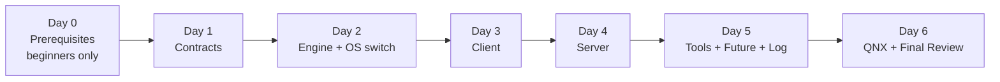

# 📖 The Message Passing Reading Plan — Your Daily Companion

> **This is the ONLY file you need to open each day.**
> It tells you **exactly what to read, in what order, and how long to spend** — down to the
> hour and minute. It is built for an **average learner spending 5 hours per day**.
>
> Beside this plan sits your reference book: **[LEARNING_GUIDE.md](LEARNING_GUIDE.md)**.
> Whenever this plan says *"read guide §X"*, it means open that section in the guide.
>
> ### 🛑 BEGINNER? Start with Day 0 first.
> If you only have **basic computer knowledge** (you're not already comfortable with C++
> classes, pointers, threads, and sockets), **do [DAY_0_PREREQUISITES.md](DAY_0_PREREQUISITES.md)
> before Day 1.** It teaches every concept the code assumes, in plain words. Skipping it means
> you *will* get stuck on Day 1. It takes 1–2 days (5–10 hours).
>
> Already comfortable with intermediate C++ and basic OS ideas? You may skip Day 0 and start at
> Day 1.
>
> **Total time to finish:**
> - With Day 0 (beginner): **~7–8 days** (Day 0 is 1–2 days + 6 days of the plan).
> - Without Day 0 (has background): **6 days × 5 hours = 30 hours.**

---

## 🧭 How to use this file every day

1. Open **this** file. Find today's day.
2. Follow each **time block** in order. Set a timer for each block.
3. Read the listed file(s) **line by line**, top to bottom.
4. After each block, write one or two sentences in your own words about what you just read.
5. At the **end of the day**, answer the **"Prove You Learned It"** questions *from memory*.
   Then check your answers against the linked proof.
6. If you cannot answer a question, re-read that file the next morning before starting.

> ⏱️ **Legend:** 🟩 = easy/warm-up · 🟨 = medium · 🟥 = hard (go slow, re-read).

---

## 📂 The reading order at a glance

**Golden path:** *Contracts → Plumbing → Client → Server → Tools → QNX & wrap-up.*
Always read **what the code promises** before **how it delivers**.

---

# 🗓️ DAY 1 — The Contracts (Interfaces) · 5 hours

> ⚠️ **Gate:** If you're a beginner and haven't done
> [DAY_0_PREREQUISITES.md](DAY_0_PREREQUISITES.md) yet, do it first — you should be able to
> answer its 11 self-check questions before starting here.
>
> **Today's mission:** Understand *what* the module promises before *how* it works.
> Read guide **§1, §2, §3, §4** alongside these files.

| Time | Duration | Difficulty | Read this | What to focus on |
| --- | --- | --- | --- | --- |
| 0:00–0:20 | 20 min | 🟩 | Guide [§1](LEARNING_GUIDE.md#1-the-10-year-old-explanation-start-here) + [§2](LEARNING_GUIDE.md#2-the-big-picture-mental-model) | The postal analogy + the 4-layer cake diagram. Draw it. |
| 0:20–0:35 | 15 min | 🟩 | [../service_protocol_config.h](../service_protocol_config.h) | The config struct: `identifier`, `max_send_size`, etc. Easy warm-up. |
| 0:35–1:00 | 25 min | 🟩 | [../i_connection_handler.h](../i_connection_handler.h) | The 3 handler methods. Small file, sets the mental model. |
| 1:00–1:10 | — | ☕ | **Break** | Stretch. |
| 1:10–1:45 | 35 min | 🟨 | [../server_types.h](../server_types.h) | `UserData` variant, the 4 callback types, `ClientIdentity` (pid/uid/gid). |
| 1:45–3:00 | 75 min | 🟥 | [../i_client_connection.h](../i_client_connection.h) | **THE most important file.** Read the 3 send methods, the `State` enum + diagram, `StopReason`, and all the callback types. Read it **twice**. |
| 3:00–3:15 | — | ☕ | **Break** | |
| 3:15–3:45 | 30 min | 🟨 | [../i_server.h](../i_server.h) + [../i_server_connection.h](../i_server_connection.h) | `StartListening` params; `Reply`/`Notify`/`RequestDisconnect`. |
| 3:45–4:20 | 35 min | 🟨 | [../i_client_factory.h](../i_client_factory.h) + [../i_server_factory.h](../i_server_factory.h) | The `ClientConfig` / `ServerConfig` knobs and what each tunes. |
| 4:20–4:35 | 15 min | 🟩 | [../client_server_communication.h](../client_server_communication.h) | The tiny wire protocol: `SEND, REQUEST, REPLY, NOTIFY`. |
| 4:35–5:00 | 25 min | 🟨 | Guide [§3](LEARNING_GUIDE.md#3-the-core-vocabulary) + [§4](LEARNING_GUIDE.md#4-the-public-interfaces-the-contracts) | Re-read to lock in vocabulary. Answer the questions below. |

### ✅ Day 1 — Prove You Learned It (answer from memory)
1. In one sentence, what problem does this whole module solve? *(proof: guide §1)*
2. Name the 4 layers of the architecture, top to bottom. *(proof: guide §2)*
3. What are the **three** ways a client can send a message, and which one **blocks**? *(proof: [../i_client_connection.h](../i_client_connection.h#L59-L83))*
4. Draw the connection **State** diagram. In which state is it safe to destroy the connection? *(proof: [../i_client_connection.h](../i_client_connection.h#L88-L106))*
5. What three pieces of identity does the server learn about a client, and why does it matter? *(proof: [../server_types.h](../server_types.h#L41-L49))*
6. What are the only **two** methods on `IServer`, and why is a server's interface so small? *(proof: [../i_server.h](../i_server.h#L48-L58))*
7. What do the enums `SEND, REQUEST, REPLY, NOTIFY` represent? *(proof: [../client_server_communication.h](../client_server_communication.h#L20-L31))*
8. Name two knobs in `ClientConfig` and say what each controls. *(proof: [../i_client_factory.h](../i_client_factory.h#L44-L62))*

### 🧪 Day 1 — Tough MCQ Test (pick ONE best answer)
> Do not peek at the answer key until you've answered all 15. Pass mark: **12/15**.

**Q1.** The whole module fundamentally provides:
- A) Multithreading inside one process
- B) Inter-Process Communication (client↔server) on the same machine
- C) A network TCP/IP stack across machines
- D) A database for messages

**Q2.** In `IClientConnection`, which method is the only **blocking** one?
- A) `Send`  B) `SendWithCallback`  C) `SendWaitReply`  D) `Start`

**Q3.** A connection may be **safely destroyed** only in state:
- A) `kStarting`  B) `kReady`  C) `kStopping`  D) `kStopped`

**Q4.** `SendWithCallback` differs from `SendWaitReply` because it:
- A) Is blocking and returns the reply directly
- B) Is non-blocking; the reply arrives later via a callback
- C) Never receives a reply
- D) Can only be used by the server

**Q5.** `ClientIdentity` exposes `pid/uid/gid` mainly to enable:
- A) Faster message transport
- B) Permission/security checks about *who* connected
- C) Memory allocation
- D) Logging severity levels

**Q6.** `IServer` has only two methods (`StartListening`/`StopListening`) because a server is essentially:
- A) Reactive — all real work happens inside callbacks
- B) Unable to send data
- C) Single-client only
- D) Stateless

**Q7.** `UserData` is a `std::variant`. That means it holds:
- A) All three alternatives at once
- B) Exactly one of its alternatives at a time
- C) Only raw pointers
- D) A thread

**Q8.** If `UserData` stores a `unique_ptr<IConnectionHandler>`, the server will:
- A) Ignore the connection
- B) Call the handler's own methods (`OnMessageSent`, …) instead of the shared callbacks
- C) Crash
- D) Use the QNX backend

**Q9.** `score::cpp::span<const std::uint8_t>` represents:
- A) A deep copy of the bytes
- B) A non-owning *view* (pointer + length) of bytes
- C) A network socket
- D) An error code

**Q10.** A function returning `expected_blank<score::os::Error>` means:
- A) It always succeeds
- B) It returns either "success, nothing" or an error — no exceptions
- C) It returns a boolean
- D) It throws on failure

**Q11.** The wire-protocol enum sent **from client to server** is:
- A) `ServerToClient { REPLY, NOTIFY }`
- B) `ClientToServer { SEND, REQUEST }`
- C) `State`
- D) `StopReason`

**Q12.** A `NOTIFY` message is sent by the:
- A) Client, expecting a reply
- B) Server, unsolicited, to the client
- C) Client, fire-and-forget
- D) Factory

**Q13.** `max_queued_sends == 0` in `ClientConfig` implies:
- A) There is no client-side send queue
- B) Unlimited queue
- C) The connection is invalid
- D) Async replies are disabled

**Q14.** The non-blocking guarantee for an ASIL-B client talking to a QM server holds only when:
- A) `fully_ordered` is true
- B) `max_queued_sends` is non-zero (messages are queued client-side)
- C) `sync_first_connect` is true
- D) The server is QNX

**Q15.** Why does the factory return `unique_ptr<IClientConnection>` (the interface) rather than the concrete class?
- A) To hide the real type so the same code works on Linux and QNX
- B) Because interfaces are faster
- C) To avoid using templates
- D) Because the concrete class is abstract

🔑 Day 1 Answer Key

1-B · 2-C · 3-D · 4-B · 5-B · 6-A · 7-B · 8-B · 9-B · 10-B · 11-B · 12-B · 13-A · 14-B · 15-A

---

# 🗓️ DAY 2 — The Engine & the OS Switch · 5 hours

> **Today's mission:** Understand the shared plumbing (threads, sockets, timers, memory).
> Read guide **§5, §6** alongside these files.

| Time | Duration | Difficulty | Read this | What to focus on |
| --- | --- | --- | --- | --- |
| 0:00–0:15 | 15 min | 🟩 | Guide [§5](LEARNING_GUIDE.md#5-the-two-worlds-qnx-vs-linux) | Why there are two OS implementations. |
| 0:15–0:45 | 30 min | 🟨 | [../engine.h](../engine.h) + [../client_factory.h](../client_factory.h) + [../server_factory.h](../server_factory.h) | The `#ifdef __QNX__` switch. See how one name maps to two classes. |
| 0:45–1:00 | — | ☕ | **Break** | |
| 1:00–2:15 | 75 min | 🟥 | [../i_shared_resource_engine.h](../i_shared_resource_engine.h) | Read **every** method. Focus on `TryOpenClientConnection`, `SendProtocolMessage`, `ReceiveProtocolMessage`, `EnqueueCommand`, `RegisterPosixEndpoint`, `CleanUpOwner`, and the `PosixEndpointEntry` struct. |
| 2:15–2:30 | 15 min | 🟩 | Guide [§6](LEARNING_GUIDE.md#6-the-engine--the-beating-heart) | Match each engine job to the method you just read. |
| 2:30–2:45 | — | ☕ | **Break** | |
| 2:45–3:30 | 45 min | 🟨 | [../unix_domain/unix_domain_engine.h](../unix_domain/unix_domain_engine.h) | The Linux engine header: `thread_`, `poll_fds_`, `RunOnThread`, `IsOnCallbackThread`, the pipe-event trick. |
| 3:30–4:45 | 75 min | 🟥 | [../unix_domain/unix_domain_engine.cpp](../unix_domain/unix_domain_engine.cpp) | The real poll loop. Follow `RunOnThread`, how endpoints are polled, how the timer queue is processed, how `CleanUpOwner` works. Go slow. |
| 4:45–5:00 | 15 min | 🟨 | Recap | Re-draw the background-thread poll loop. Answer questions. |

### ✅ Day 2 — Prove You Learned It
1. How does the code decide whether to use QNX or Unix code? Which macro? *(proof: [../engine.h](../engine.h#L16-L20))*
2. Why is the engine shared with a `std::shared_ptr`? Who shares it? *(proof: [../unix_domain/unix_domain_engine.h](../unix_domain/unix_domain_engine.h#L38-L41))*
3. List four responsibilities of the engine and the method for each. *(proof: guide §6 table)*
4. What does a `PosixEndpointEntry` represent, and what are its callbacks (`input`, `disconnect`, …)? *(proof: [../i_shared_resource_engine.h](../i_shared_resource_engine.h#L74-L86))*
5. How does the engine run background work, and how can code check "am I on the callback thread"? *(proof: [../unix_domain/unix_domain_engine.h](../unix_domain/unix_domain_engine.h#L112-L134))*
6. Why does the engine have `SendProtocolMessage` / `ReceiveProtocolMessage` instead of the connection writing to the socket directly? *(proof: [../i_shared_resource_engine.h](../i_shared_resource_engine.h#L50-L56))*

### 🧪 Day 2 — Tough MCQ Test (pick ONE best answer)
> Pass mark: **12/15**.

**Q1.** The choice between the QNX and Unix implementation is made:
- A) At runtime via a config file
- B) At compile time via `#ifdef __QNX__`
- C) By the user calling a setter
- D) Randomly per connection

**Q2.** The `Engine` is shared among factories, servers, and connections using:
- A) A raw pointer
- B) `std::unique_ptr`
- C) `std::shared_ptr`
- D) A global variable

**Q3.** The engine runs its event loop on:
- A) The caller's thread
- B) One dedicated background thread
- C) A new thread per message
- D) No thread

**Q4.** A `PosixEndpointEntry` primarily lets a component say:
- A) "Allocate memory for me"
- B) "Call me when this file descriptor is ready (input/disconnect/…)"
- C) "Start a new process"
- D) "Log this message"

**Q5.** `IsOnCallbackThread()` exists mainly to:
- A) Speed up sends
- B) Detect whether we're already on the engine thread, to avoid deadlocks
- C) Count threads
- D) Pick QNX vs Unix

**Q6.** `GetMemoryResource()` returning a `pmr::memory_resource*` supports the theme of:
- A) Faster networking
- B) Controlled, predictable memory (no surprise heap use)
- C) Encryption
- D) Logging

**Q7.** The Unix engine watches many file descriptors efficiently using:
- A) A busy-wait loop
- B) `poll()` over `poll_fds_`
- C) One thread per fd
- D) Interrupts

**Q8.** `EnqueueCommand(...)` is used to:
- A) Send bytes on a socket
- B) Schedule immediate or delayed (timed) work
- C) Open a connection
- D) Register a logger

**Q9.** `CleanUpOwner(owner)` is designed to:
- A) Free all queued entries/endpoints belonging to one owner at once
- B) Delete the whole engine
- C) Close the process
- D) Reset the logger

**Q10.** `SendProtocolMessage`/`ReceiveProtocolMessage` live in the engine because:
- A) The transport (socket/channel) belongs to the shared engine layer
- B) Connections cannot hold data
- C) They are templates
- D) QNX requires it only

**Q11.** Putting the fd-watching + protocol in the engine lets client/server code be:
- A) OS-specific
- B) OS-agnostic (same logic on Linux and QNX)
- C) Single-threaded only
- D) Slower

**Q12.** The `code` parameter in `SendProtocolMessage(fd, code, message)` carries:
- A) An error number
- B) The message *type* (e.g., SEND/REQUEST/REPLY/NOTIFY)
- C) The thread id
- D) The memory size

**Q13.** Multiple engine instances in one process are:
- A) Forbidden
- B) Allowed (each with its own thread/memory), e.g. to break cyclic topologies
- C) Automatically merged
- D) Only allowed on QNX

**Q14.** `ReceiveProtocolMessage` returns a `span` that:
- A) Owns a fresh heap copy of the bytes
- B) Views bytes in an engine-managed buffer
- C) Is always empty
- D) Is a socket handle

**Q15.** The engine's `GetLogger()` returns a reference so that:
- A) Every log call allocates
- B) Callers share one pluggable logger without copying it
- C) Logging is disabled
- D) The OS is chosen

🔑 Day 2 Answer Key

1-B · 2-C · 3-B · 4-B · 5-B · 6-B · 7-B · 8-B · 9-A · 10-A · 11-B · 12-B · 13-B · 14-B · 15-B

---

# 🗓️ DAY 3 — The Client Implementation · 5 hours

> **Today's mission:** See how `ClientConnection` actually turns your calls into bytes.
> Read guide **§7** alongside these files.

| Time | Duration | Difficulty | Read this | What to focus on |
| --- | --- | --- | --- | --- |
| 0:00–0:15 | 15 min | 🟩 | Guide [§7](LEARNING_GUIDE.md#7-the-client-side--step-by-step) | The client ingredients + the zero-allocation send pool. |
| 0:15–1:15 | 60 min | 🟥 | [../client_connection.h](../client_connection.h) | Every member variable. Especially `send_storage_`, `send_pool_`, `send_queue_` (the pre-allocated pool) and the private helper method names. |
| 1:15–1:30 | — | ☕ | **Break** | |
| 1:30–3:00 | 90 min | 🟥 | [../client_connection.cpp](../client_connection.cpp) — part 1 | `Start`, `TryConnect`, the state-change helpers, `Stop`, `Restart`. Trace how the state machine moves. |
| 3:00–3:15 | — | ☕ | **Break** | |
| 3:15–4:15 | 60 min | 🟥 | [../client_connection.cpp](../client_connection.cpp) — part 2 | The three sends: `Send`, `SendWaitReply`, `SendWithCallback`; `TryQueueMessage`; `ProcessInputEvent`; `ProcessSendQueueUnderLock`. |
| 4:15–4:40 | 25 min | 🟨 | [../unix_domain/unix_domain_client_factory.h](../unix_domain/unix_domain_client_factory.h) + `.cpp` | How the factory builds a `ClientConnection`. |
| 4:40–5:00 | 20 min | 🟨 | [../client_connection_test.cpp](../client_connection_test.cpp) | Skim a real test to see the API used for real. Answer questions. |

### ✅ Day 3 — Prove You Learned It
1. Explain the "zero-allocation send pool." Why does it exist? *(proof: [../client_connection.h](../client_connection.h#L108-L132))*
2. Trace `SendWaitReply` from the call until the reply returns. Which members are involved? *(proof: [../client_connection.cpp](../client_connection.cpp))*
3. What happens inside `TryConnect`, and what state does the connection enter? *(proof: [../client_connection.h](../client_connection.h#L64))*
4. Why are `state_` and `stop_reason_` **atomic**? *(proof: [../client_connection.h](../client_connection.h#L91-L92))*
5. What is the difference in behavior between `Send` and `SendWithCallback`? *(proof: [../i_client_connection.h](../i_client_connection.h#L59-L83))*
6. Where does the factory get the engine it hands to the connection? *(proof: [../unix_domain/unix_domain_client_factory.h](../unix_domain/unix_domain_client_factory.h))*

### 🧪 Day 3 — Tough MCQ Test (pick ONE best answer)
> Pass mark: **12/15**.

**Q1.** The "zero-allocation send pool" means the client:
- A) Never sends messages
- B) Pre-allocates message slots at construction and recycles them
- C) Allocates on every send
- D) Uses the OS heap directly

**Q2.** `send_pool_` and `send_queue_` are **intrusive lists** so that moving a message between them:
- A) Allocates a node each time
- B) Requires no heap allocation
- C) Copies the whole message
- D) Blocks the thread

**Q3.** `state_` is `std::atomic<State>` because it is:
- A) Large
- B) Read/written by multiple threads and must not tear
- C) Constant
- D) A pointer

**Q4.** `SendWaitReply` blocks the caller until a reply arrives, typically implemented by:
- A) Busy-spinning forever
- B) Sleeping on a condition_variable and being woken when the reply lands
- C) Polling the disk
- D) Spawning a process

**Q5.** After `Start()` succeeds in connecting, the connection moves toward:
- A) `kStopped`
- B) `kReady`
- C) `kStopping`
- D) `kInit`

**Q6.** `Send` (fire-and-forget) compared to `SendWithCallback`:
- A) Waits for a reply
- B) Expects no reply; callback version registers for one
- C) Is blocking
- D) Cannot fail

**Q7.** The client gets its `ISharedResourceEngine` from:
- A) A global singleton
- B) The factory that created it (shared engine)
- C) A new engine per send
- D) The OS kernel

**Q8.** `ProcessInputEvent()` runs when:
- A) The user calls Send
- B) The engine signals the client's fd has incoming data
- C) The object is constructed
- D) A timer is set

**Q9.** Storage for async messages is bounded by:
- A) `max_queued_sends` / `max_async_replies` in `ClientConfig`
- B) Available disk
- C) Nothing — it's unbounded
- D) The server

**Q10.** `ProcessSendQueueUnderLock` is named "under lock" because it:
- A) Must be called while holding the send mutex
- B) Locks a file
- C) Encrypts data
- D) Runs on the OS thread only

**Q11.** The `.h` file is read before the `.cpp` in the plan because:
- A) `.cpp` is optional
- B) The header shows the *shape* (what), the source shows the *how*
- C) Headers run first
- D) `.cpp` has no code

**Q12.** `Restart()` is meaningful when the connection is in:
- A) `kReady`
- B) `kStopped` (try to reconnect)
- C) `kStarting`
- D) never

**Q13.** The client is declared `final`, meaning:
- A) It cannot be further subclassed
- B) It cannot be constructed
- C) It is abstract
- D) It is const

**Q14.** A message too large for `max_send_size` will cause `Send` to:
- A) Silently truncate
- B) Fail (return an error)
- C) Split across the network
- D) Block forever

**Q15.** The pre-allocation strategy exists chiefly to satisfy:
- A) Faster CPU clocks
- B) Safety: deterministic behavior with no runtime heap allocation
- C) Smaller binary size
- D) Network compatibility

🔑 Day 3 Answer Key

1-B · 2-B · 3-B · 4-B · 5-B · 6-B · 7-B · 8-B · 9-A · 10-A · 11-B · 12-B · 13-A · 14-B · 15-B

---

# 🗓️ DAY 4 — The Server Implementation · 5 hours

> **Today's mission:** See how one server serves many clients.
> Read guide **§8, §10** alongside these files.

| Time | Duration | Difficulty | Read this | What to focus on |
| --- | --- | --- | --- | --- |
| 0:00–0:15 | 15 min | 🟩 | Guide [§8](LEARNING_GUIDE.md#8-the-server-side--step-by-step) | The server + per-client `ServerConnection` model. |
| 0:15–1:00 | 45 min | 🟨 | [../unix_domain/unix_domain_server.h](../unix_domain/unix_domain_server.h) | `UnixDomainServer` + nested `ServerConnection`. Note the `self_` self-ownership trick. |
| 1:00–1:15 | — | ☕ | **Break** | |
| 1:15–3:00 | 105 min | 🟥 | [../unix_domain/unix_domain_server.cpp](../unix_domain/unix_domain_server.cpp) | `StartListening`, `ProcessConnect`, `AcceptConnection`, `ProcessInput`, `Reply`, `Notify`, `RequestDisconnect`, `StopListening`. Go slow. |
| 3:00–3:15 | — | ☕ | **Break** | |
| 3:15–3:45 | 30 min | 🟨 | [../unix_domain/unix_domain_server_factory.h](../unix_domain/unix_domain_server_factory.h) + `.cpp` | How servers are created and how they share the engine. |
| 3:45–4:15 | 30 min | 🟨 | Guide [§10](LEARNING_GUIDE.md#10-how-a-message-actually-travels-full-flow) | The full end-to-end message-flow sequence diagram. |
| 4:15–5:00 | 45 min | 🟨 | [../unix_domain_server_to_client_test.cpp](../unix_domain_server_to_client_test.cpp) | Read a full end-to-end test. Then answer questions. |

### ✅ Day 4 — Prove You Learned It
1. How does one server handle **many** clients at the same time? *(proof: [../i_server.h](../i_server.h#L26-L28))*
2. What is the `self_` pointer in `ServerConnection` for? *(proof: [../unix_domain/unix_domain_server.h](../unix_domain/unix_domain_server.h#L58))*
3. What are the 4 callbacks passed to `StartListening` and when is each fired? *(proof: [../i_server.h](../i_server.h#L48-L53) + [../server_types.h](../server_types.h#L27-L34))*
4. Trace a request→reply across client and server using the §10 sequence diagram. *(proof: guide §10)*
5. When you store an `IConnectionHandler` in `UserData`, what changes about how messages are handled? *(proof: [../i_connection_handler.h](../i_connection_handler.h#L38-L45))*
6. What does `StopListening` guarantee about running callbacks? *(proof: [../i_server.h](../i_server.h#L54-L58))*

### 🧪 Day 4 — Tough MCQ Test (pick ONE best answer)
> Pass mark: **12/15**.

**Q1.** One `IServer` serves many clients by giving each client:
- A) A separate process
- B) Its own `ServerConnection` (per-client session object)
- C) A shared single buffer
- D) A new server instance

**Q2.** The `self_` pointer inside `ServerConnection` implements:
- A) A copy constructor
- B) Self-ownership so the object stays alive exactly as long as needed
- C) A logger
- D) Thread creation

**Q3.** `ProcessConnect()` runs when:
- A) The server shuts down
- B) A new client connects to the named endpoint
- C) A reply is sent
- D) A timer fires

**Q4.** Callbacks belonging to the *same session* are guaranteed to be:
- A) Run in parallel
- B) Serialized (one at a time, in order)
- C) Dropped
- D) Run on the caller's thread

**Q5.** `StopListening()` must **not** be called from:
- A) The main thread
- B) Inside a server callback (it may block waiting for callbacks to finish)
- C) The constructor
- D) A factory

**Q6.** The four callbacks of `StartListening` are connect, disconnect, and:
- A) two message callbacks (sent, sent-with-reply)
- B) two timer callbacks
- C) log + error
- D) start + stop

**Q7.** `Reply(...)` on a `ServerConnection` sends a message coded as:
- A) `NOTIFY`
- B) `REPLY`
- C) `SEND`
- D) `REQUEST`

**Q8.** `Notify(...)` differs from `Reply(...)` because it is:
- A) A response to a specific request
- B) An *unsolicited* push to the client
- C) Only for QNX
- D) Blocking

**Q9.** The `ConnectCallback` returns an `expected<UserData, Error>`; returning an error means:
- A) The connection is accepted anyway
- B) The server refuses that connection
- C) The client retries forever
- D) The engine crashes

**Q10.** Storing an `IConnectionHandler` in `UserData` causes the server to:
- A) Use the handler's methods instead of the shared message callbacks
- B) Ignore messages
- C) Switch OS
- D) Disable replies

**Q11.** `GetClientIdentity()` is used by the server to:
- A) Allocate memory
- B) Check who connected (pid/uid/gid) for permissions
- C) Choose the transport
- D) Log severity

**Q12.** A server can have multiple sessions from the *same* client process because:
- A) Each `Start()` on the client can open a distinct connection/session
- B) Processes are duplicated
- C) The OS forbids it
- D) Only one is ever allowed

**Q13.** `RequestDisconnect()` effectively:
- A) Kills the whole server
- B) Asks to tear down that one connection
- C) Sends a NOTIFY
- D) Restarts the engine

**Q14.** The server shares the same `Engine` as the client when tests pass `GetEngine()` in order to:
- A) Use one background thread for both (same-engine topology)
- B) Save disk
- C) Encrypt traffic
- D) Avoid the factory

**Q15.** `StopListening` guarantees that after it returns:
- A) Callbacks may still be running
- B) No callback is running and resources can be released
- C) The client is destroyed
- D) The memory resource is freed

🔑 Day 4 Answer Key

1-B · 2-B · 3-B · 4-B · 5-B · 6-A · 7-B · 8-B · 9-B · 10-A · 11-B · 12-A · 13-B · 14-A · 15-B

---

# 🗓️ DAY 5 — Supporting Tools (Queue, Future, Log) · 5 hours

> **Today's mission:** Understand the small tools the engine relies on.
> Read guide **§9** alongside these files.

| Time | Duration | Difficulty | Read this | What to focus on |
| --- | --- | --- | --- | --- |
| 0:00–0:15 | 15 min | 🟩 | Guide [§9](LEARNING_GUIDE.md#9-supporting-tools-queue-future-log) | Overview of the 3 tools. |
| 0:15–0:45 | 30 min | 🟨 | [../timed_command_queue_entry.h](../timed_command_queue_entry.h) + [../timed_command_queue.h](../timed_command_queue.h) | Intrusive-list queue; immediate vs timed entries; `owner` for cleanup. |
| 0:45–1:45 | 60 min | 🟥 | [../timed_command_queue.cpp](../timed_command_queue.cpp) | `ProcessQueue`, ordering logic, `CleanUpOwner`. Follow the linked-list carefully. |
| 1:45–2:00 | — | ☕ | **Break** | |
| 2:00–2:40 | 40 min | 🟨 | [../non_allocating_future/README.md](../non_allocating_future/README.md) | Why `std::future` is avoided; the Future+Promise dual role; the usage protocol. |
| 2:40–3:40 | 60 min | 🟥 | [../non_allocating_future/non_allocating_future.h](../non_allocating_future/non_allocating_future.h) | `Wait`, `GetValue`, `MarkReady`, `UpdateValueMarkReady`, the `void` specialization. |
| 3:40–3:55 | — | ☕ | **Break** | |
| 3:55–4:30 | 35 min | 🟨 | [../log/logging_callback.h](../log/logging_callback.h) + [../log/log.h](../log/log.h) | `LogSeverity`, `LogItem` variant, `GetCerrLogger`, the `LogConvert` helpers. |
| 4:30–5:00 | 30 min | 🟨 | [../non_allocating_future/non_allocating_future_samples_test.cpp](../non_allocating_future/non_allocating_future_samples_test.cpp) | See the future used in practice. Answer questions. |

### ✅ Day 5 — Prove You Learned It
1. Why does `TimedCommandQueue` use an **intrusive list** instead of a normal container? *(proof: [../timed_command_queue.h](../timed_command_queue.h#L26-L30) + guide §9.1)*
2. What is the `owner` argument for, and why does `nullptr` remove nothing? *(proof: [../timed_command_queue.h](../timed_command_queue.h#L64-L74))*
3. Why is `NonAllocatingFuture` used instead of `std::future`? *(proof: [../non_allocating_future/README.md](../non_allocating_future/README.md#L1-L13))*
4. `NonAllocatingFuture` plays two roles — which two, and which methods belong to each? *(proof: [../non_allocating_future/README.md](../non_allocating_future/README.md#L27-L34))*
5. What are the log severities and what is a `LogItem`? *(proof: [../log/logging_callback.h](../log/logging_callback.h#L24-L38))*
6. Why does the module use a custom pluggable logger instead of `std::cout` everywhere? *(proof: guide §9.3)*

### 🧪 Day 5 — Tough MCQ Test (pick ONE best answer)
> Pass mark: **12/15**.

**Q1.** `TimedCommandQueue` uses an intrusive list mainly to:
- A) Sort faster
- B) Queue commands with zero heap allocation
- C) Support networking
- D) Encrypt commands

**Q2.** An "immediate" entry is ordered:
- A) After all timed entries
- B) Before any timed entry, after other immediates
- C) Randomly
- D) By owner address

**Q3.** The `owner` argument to the queue enables:
- A) Bulk removal of all entries for one owner
- B) Faster sends
- C) Logging
- D) Thread creation

**Q4.** Passing `nullptr` as `owner` to `CleanUpOwner` removes:
- A) Everything
- B) Nothing (by design, to avoid interfering with other users)
- C) Only timed entries
- D) Only immediate entries

**Q5.** `NonAllocatingFuture` is preferred over `std::future` because `std::future`:
- A) Is faster
- B) Tends to allocate OS/heap resources per use
- C) Cannot return values
- D) Needs QNX

**Q6.** `NonAllocatingFuture` plays the role of BOTH:
- A) Client and server
- B) Future (Wait/GetValue) and Promise (MarkReady)
- C) Logger and queue
- D) Socket and pipe

**Q7.** It relies on external objects, specifically a:
- A) mutex + condition_variable (or equivalents)
- B) socket + fd
- C) thread + process
- D) file + disk

**Q8.** The Promise side must call `MarkReady()`/`UpdateValueMarkReady()`:
- A) Never
- B) Exactly once, and then stop touching the object
- C) Repeatedly
- D) Only on error

**Q9.** The `void` specialization of `NonAllocatingFuture` is used when you only need to signal:
- A) A returned value
- B) That an event happened (no value)
- C) An error code
- D) A byte buffer

**Q10.** `LogItem` is a `std::variant`, so a single log argument can be:
- A) Only a string
- B) One of: string_view / int64 / uint64 / pointer
- C) A thread
- D) A socket

**Q11.** `LogSeverity` ranges from most to least severe as:
- A) kVerbose → kFatal
- B) kFatal → kVerbose
- C) kInfo → kError
- D) unordered

**Q12.** `GetCerrLogger()` provides:
- A) A no-op logger
- B) A default logger that writes to stderr
- C) A file logger
- D) A network logger

**Q13.** The `LogConvert` helper templates exist to:
- A) Encrypt logs
- B) Safely turn various argument types into a `LogItem`
- C) Allocate memory
- D) Pick the OS

**Q14.** A pluggable `LoggingCallback` is used instead of hard-coded `std::cout` so that:
- A) The host project can route logs into its own system without allocation/blocking
- B) It is faster to type
- C) QNX requires printf
- D) Logging is disabled by default

**Q15.** The common design theme uniting the queue, the future, and the pools is:
- A) Encryption
- B) Avoiding runtime memory allocation / being deterministic & safe
- C) Faster networking
- D) Smaller source files

🔑 Day 5 Answer Key

1-B · 2-B · 3-A · 4-B · 5-B · 6-B · 7-A · 8-B · 9-B · 10-B · 11-B · 12-B · 13-B · 14-A · 15-B

---

# 🗓️ DAY 6 — QNX World + Final Review · 5 hours

> **Today's mission:** Understand the QNX structure (don't master it unless you deploy there),
> then rebuild the whole module in your head. Read guide **§11, §12**.

| Time | Duration | Difficulty | Read this | What to focus on |
| --- | --- | --- | --- | --- |
| 0:00–0:45 | 45 min | 🟥 | [../qnx_dispatch/qnx_dispatch_engine.h](../qnx_dispatch/qnx_dispatch_engine.h) | `ResourceManagerServer`, `ResourceManagerConnection`, `OsResources`. Compare to the Unix engine. |
| 0:45–1:15 | 30 min | 🟨 | [../qnx_dispatch/dispatch_thread_runner.h](../qnx_dispatch/dispatch_thread_runner.h) | Why QNX uses a separate dispatch-thread runner (deadlock avoidance for cyclic topologies). |
| 1:15–1:30 | — | ☕ | **Break** | |
| 1:30–2:15 | 45 min | 🟨 | [../qnx_dispatch/qnx_dispatch_server.h](../qnx_dispatch/qnx_dispatch_server.h) + [../qnx_dispatch/qnx_dispatch_client_factory.h](../qnx_dispatch/qnx_dispatch_client_factory.h) | Map each QNX piece to its Unix equivalent. |
| 2:15–2:30 | 15 min | 🟩 | [../qnx_dispatch/qnx_resource_path.h](../qnx_dispatch/qnx_resource_path.h) | How a server name becomes a QNX resource path. |
| 2:30–2:45 | — | ☕ | **Break** | |
| 2:45–3:30 | 45 min | 🟨 | Guide [§11](LEARNING_GUIDE.md#11-revision-notes-quick-cheat-sheet) | Read the cheat sheet slowly. Fill any gaps by re-reading. |
| 3:30–4:30 | 60 min | 🟥 | **Blank-page test** | On a blank sheet redraw: the 4-layer diagram, the State machine, and the message-flow sequence — all from memory. |
| 4:30–5:00 | 30 min | 🟨 | Guide [§12](LEARNING_GUIDE.md#12-line-by-line-reading-plan-day-by-day-5-hrsday) + this file | Final review. Answer the comprehensive questions below. |

### ✅ Day 6 — Final Comprehensive Test (covers ALL days)
1. **(Day 1)** State the module's purpose and its 4 architecture layers.
2. **(Day 1)** List the 3 client send methods, the 4 states, and the wire-protocol enums.
3. **(Day 2)** Explain the engine's role and how the OS is chosen at compile time.
4. **(Day 2)** What is a `PosixEndpointEntry` and how does the poll loop use it?
5. **(Day 3)** Explain the zero-allocation send pool and trace `SendWaitReply`.
6. **(Day 4)** Explain how one server serves many clients and what `self_` does.
7. **(Day 4)** Redraw the full request→reply message flow.
8. **(Day 5)** Why intrusive lists + `NonAllocatingFuture` + pluggable logger? (One theme connects them — name it.)
9. **(Day 6)** Name two things the QNX engine has that the Unix engine does not, and why.
10. **(All)** In 3 sentences, teach the whole module to a friend who has never seen it.

> 🎯 **You have finished when you can answer all 10 without looking.** If a question stumps
> you, the day tag tells you exactly which day's files to re-read.

### 🧪 Day 6 — Final Tough MCQ Test (covers ALL days)
> Pass mark: **12/15**. This is your graduation exam.

**Q1.** The module's core purpose is:
- A) On-machine client↔server IPC that is safe and predictable
- B) A GUI framework
- C) A TCP router
- D) A compiler

**Q2.** The 4 architecture layers top→bottom are:
- A) OS → Engine → Impl → Interfaces
- B) Interfaces → Impl classes → Engine → OS
- C) Engine → OS → Interfaces → Impl
- D) Impl → Interfaces → OS → Engine

**Q3.** The three client send methods are:
- A) Send / SendWaitReply / SendWithCallback
- B) Push / Pull / Poll
- C) Open / Close / Reset
- D) Read / Write / Seek

**Q4.** The connection state order is:
- A) kReady → kStarting → kStopped → kStopping
- B) kStarting → kReady → kStopping → kStopped
- C) kStopped → kReady → kStarting → kStopping
- D) kStarting → kStopping → kReady → kStopped

**Q5.** The OS backend is chosen by:
- A) `#ifdef __QNX__` at compile time
- B) A runtime flag
- C) The client config
- D) The server name

**Q6.** `PosixEndpointEntry` is used by the poll loop to know:
- A) Which fd to watch and which callback to fire on activity
- B) How much memory to allocate
- C) The log level
- D) The client's uid

**Q7.** The zero-allocation send pool relies on:
- A) `new`/`delete` per message
- B) Pre-allocated storage + intrusive lists
- C) A database
- D) The network stack

**Q8.** In request→reply, the server answers using:
- A) `Notify`
- B) `Reply` (coded REPLY)
- C) `Send`
- D) `Start`

**Q9.** One server serves many clients because:
- A) Each client gets its own `ServerConnection` session
- B) It forks per client
- C) It blocks all but one
- D) The OS multiplexes automatically

**Q10.** `self_` in `ServerConnection` keeps the object alive by:
- A) Copying it
- B) Holding ownership of itself until disconnect
- C) Using a global
- D) Restarting the engine

**Q11.** The single theme uniting intrusive lists, `NonAllocatingFuture`, and pluggable logging is:
- A) Avoid runtime allocation / stay deterministic & safe
- B) Maximize network speed
- C) Reduce compile time
- D) Encrypt everything

**Q12.** On QNX, the named service is implemented with a:
- A) Unix domain socket
- B) Resource Manager (channels + pulses)
- C) TCP port
- D) Shared file

**Q13.** QNX uses a separate `DispatchThreadRunner` for client vs server to:
- A) Save memory
- B) Avoid deadlocks in client-server topologies with cycles
- C) Support logging
- D) Speed up sends

**Q14.** `expected`/`expected_blank` return types exist to:
- A) Throw exceptions
- B) Report success-or-error explicitly without exceptions
- C) Allocate memory
- D) Choose the OS

**Q15.** The engine is `shared_ptr`-shared because:
- A) Only one owner is allowed
- B) Factories, servers, and connections all need it alive simultaneously
- C) It must be copied per send
- D) QNX requires it

🔑 Day 6 Answer Key

1-A · 2-B · 3-A · 4-B · 5-A · 6-A · 7-B · 8-B · 9-A · 10-B · 11-A · 12-B · 13-B · 14-B · 15-B

> 🏁 **Scored 12+/15 on all six days?** You genuinely understand `message_passing`. If you
> missed some, the topic of each missed question tells you exactly what to re-read.

---

## 🔁 If you fall behind or want to go slower

- This plan assumes **6 days**. If you're an average learner having a hard week, split each
  🟥 (hard) block across two sittings and stretch to **8–9 days** — that's completely fine.
- The **only rule that matters:** never move to the next day until you can answer *today's*
  "Prove You Learned It" questions. Understanding compounds — Day 3 needs Day 2.

## 📌 Quick file-finder (when you just need to jump somewhere)

| I want to understand… | Open |
| --- | --- |
| Prerequisite concepts (beginner) | [DAY_0_PREREQUISITES.md](DAY_0_PREREQUISITES.md) |
| The big picture | [LEARNING_GUIDE.md §2](LEARNING_GUIDE.md#2-the-big-picture-mental-model) |
| What the client can do | [../i_client_connection.h](../i_client_connection.h) |
| What the server can do | [../i_server.h](../i_server.h) + [../i_server_connection.h](../i_server_connection.h) |
| The shared plumbing | [../i_shared_resource_engine.h](../i_shared_resource_engine.h) |
| Linux internals | [../unix_domain/](../unix_domain/) |
| QNX internals | [../qnx_dispatch/](../qnx_dispatch/) |
| The scheduler | [../timed_command_queue.h](../timed_command_queue.h) |
| Blocking-without-allocating | [../non_allocating_future/README.md](../non_allocating_future/README.md) |
| A quick cheat sheet | [LEARNING_GUIDE.md §11](LEARNING_GUIDE.md#11-revision-notes-quick-cheat-sheet) |
