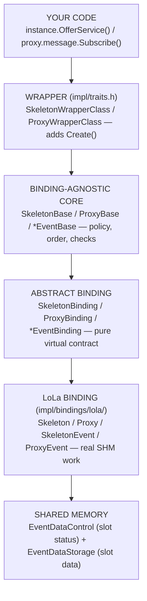
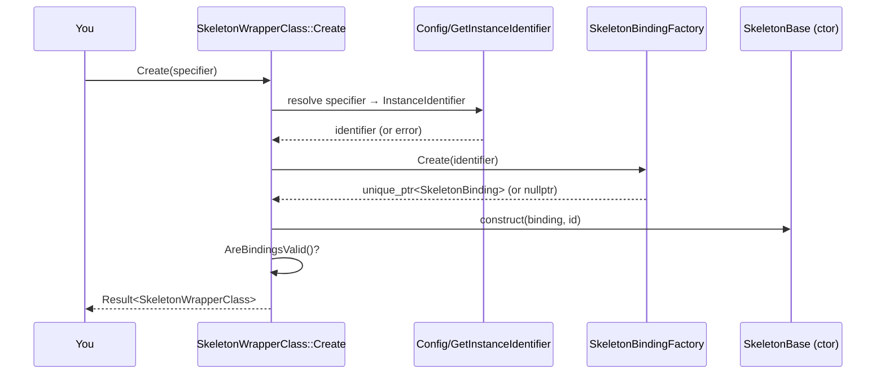
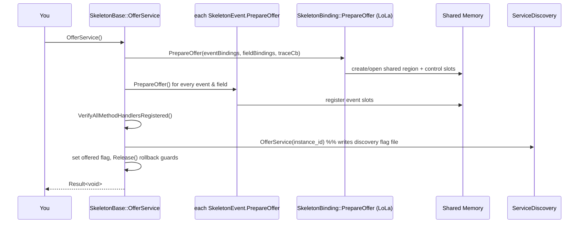
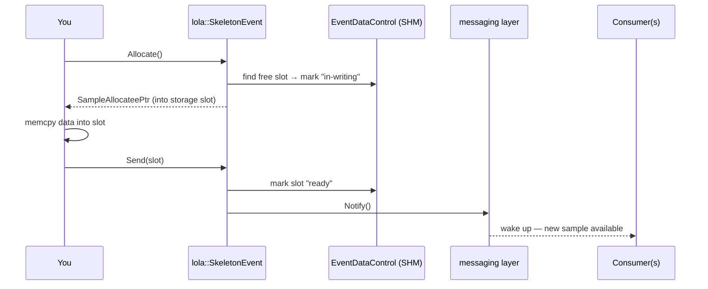
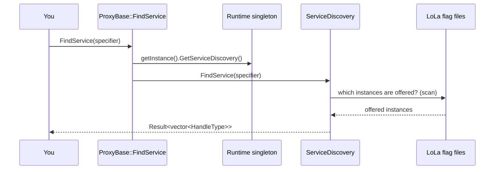
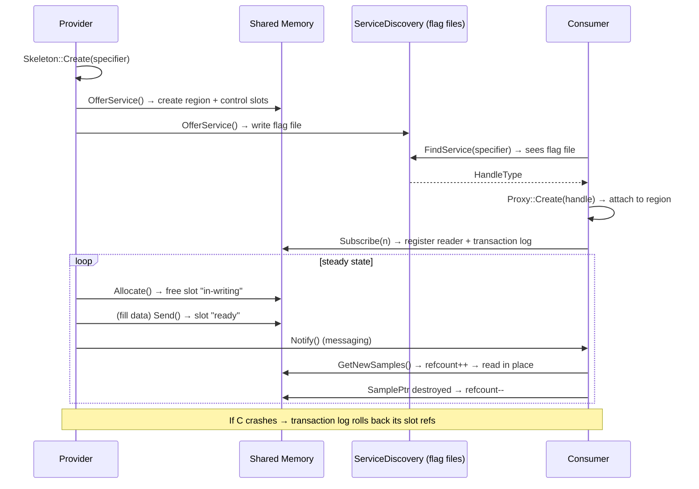

<!--
*******************************************************************************
Copyright (c) 2026 Contributors to the Eclipse Foundation

See the NOTICE file(s) distributed with this work for additional
information regarding copyright ownership.

This program and the accompanying materials are made available under the
terms of the Apache License Version 2.0 which is available at
https://www.apache.org/licenses/LICENSE-2.0

SPDX-License-Identifier: Apache-2.0
*******************************************************************************
-->

# LoLa API Deep‑Dive — Every Call, Root to Tip 🔬

Companion to [README.md](README.md), [MENTAL_MODEL.md](MENTAL_MODEL.md),
[LINE_BY_LINE_PLAN.md](LINE_BY_LINE_PLAN.md).

This file answers **"what actually happens when I call this API?"** for every important
public function. Each entry has:
- **Signature** (what you write)
- **Layer path** (which classes it travels through)
- **Step‑by‑step** what happens internally, with proof lines
- **A visual** (sequence or flow diagram)

> All call chains below are traced from real source — the proof links point to the exact
> function that does the work.

---

## The universal layer map (memorise this once)

Every API you call travels the **same 4 layers**. If you hold this picture, every function
below is just "where on these rails am I?".



- **Why 4 layers?** Core = *what to do* (policy). Binding = *how to move bytes* (mechanism).
  Splitting them lets a **mock binding** replace LoLa in tests, and lets a future **SomeIp**
  binding be added without touching your code. Proof: `BindingType{kLoLa,kFake,kSomeIp}` in
  [../../impl/binding_type.h](../../impl/binding_type.h).

---

# PART 1 — PROVIDER (Skeleton) APIs

## 1.1 `Skeleton::Create(specifier)` — build the provider object

**Signature**
```cpp
auto result = HelloWorldSkeleton::Create(instance_specifier.value());  // Result<SkeletonWrapperClass>
```

**Layer path:** `SkeletonWrapperClass::Create` → `GetInstanceIdentifier` → `SkeletonBindingFactory::Create` → `SkeletonBase` ctor

**Step‑by‑step (proof: [../../impl/traits.h#L200-L253](../../impl/traits.h#L200-L253)):**
1. Resolve the **name → identity**: `GetInstanceIdentifier(specifier)` looks it up in the parsed
   config. If not found → `kInvalidInstanceIdentifierString`. → [../../impl/traits.h#L210-L217](../../impl/traits.h#L210-L217)
2. Build the **binding**: `SkeletonBindingFactory::Create(instance_identifier)`. If it returns
   `nullptr` → `kBindingFailure`. → [../../impl/traits.h#L227-L234](../../impl/traits.h#L227-L234)
3. Construct the wrapper, forwarding binding + id **up into `SkeletonBase`'s constructor**. → [../../impl/traits.h#L241](../../impl/traits.h#L241)
4. `AreBindingsValid()` verifies every event/field binding was created; else `kBindingFailure`. → [../../impl/traits.h#L242-L249](../../impl/traits.h#L242-L249)
5. Return the ready wrapper inside a `Result`.



**Why a `Result` and not a thrown exception?** The whole stack is exception‑free for safety
determinism — you must check `.has_value()`. Proof: return type `Result<...>` and
`MakeUnexpected(...)` throughout [../../impl/traits.h#L200-L253](../../impl/traits.h#L200-L253).

---

## 1.2 `skeleton.OfferService()` — announce the service (the big one)

**Signature**
```cpp
Result<void> r = instance.OfferService();
```

**Layer path:** `SkeletonBase::OfferService` → per‑event/field `PrepareOffer` → `SkeletonBinding::PrepareOffer` → `ServiceDiscovery::OfferService`

**Step‑by‑step (proof: [../../impl/skeleton_base.cpp#L148-L220](../../impl/skeleton_base.cpp#L148-L220)):**
1. If a **mock** was injected, short‑circuit to it. → [../../impl/skeleton_base.cpp#L150-L153](../../impl/skeleton_base.cpp#L150-L153)
2. Collect binding pointers for every event and field into maps
   (`GetSkeletonEventBindingsMap` / `GetSkeletonFieldBindingsMap`). → [../../impl/skeleton_base.cpp#L155-L156](../../impl/skeleton_base.cpp#L155-L156)
3. Create the **tracing SHM‑object callback** (so tracing can see the shared memory). → [../../impl/skeleton_base.cpp#L158-L159](../../impl/skeleton_base.cpp#L158-L159)
4. Call the **binding's** `PrepareOffer(...)` — this is where LoLa creates/opens the shared
   memory region. A `ScopeExit` guard is armed to auto‑rollback if a later step fails. → [../../impl/skeleton_base.cpp#L161-L172](../../impl/skeleton_base.cpp#L161-L172)
5. `OfferServiceEvents()` calls `PrepareOffer()` on **each event**; same for fields. Each also
   arms a rollback guard. → [../../impl/skeleton_base.cpp#L101-L146](../../impl/skeleton_base.cpp#L101-L146), [#L174-L186](../../impl/skeleton_base.cpp#L174-L186)
6. `VerifyAllMethodHandlersRegistered()` ensures every method/field‑getter has a handler. → [../../impl/skeleton_base.cpp#L188-L196](../../impl/skeleton_base.cpp#L188-L196)
7. **Register in service discovery**: `Runtime::getInstance().GetServiceDiscovery().OfferService(id)`
   — this drops the flag file consumers watch for. → [../../impl/skeleton_base.cpp#L198-L206](../../impl/skeleton_base.cpp#L198-L206)
8. Set the "offered" flag, then **`Release()` all rollback guards** (success = don't undo). → [../../impl/skeleton_base.cpp#L208-L220](../../impl/skeleton_base.cpp#L208-L220)



**Underlying "why" — the rollback guards:** if step 7 fails, the shared memory and event
offers created in steps 4–5 must be undone, or you'd leak SHM. `ScopeExit` guards do this
automatically unless released on success. Proof: `utils::ScopeExit binding_offer_guard` and
`release_guards(...)` in [../../impl/skeleton_base.cpp#L170-L219](../../impl/skeleton_base.cpp#L170-L219).

---

## 1.3 `skeletonEvent.Allocate()` — reserve a shared slot

**Signature**
```cpp
auto slot = instance.message.Allocate();   // Result<SampleAllocateePtr<T>>
```

**Layer path:** `SkeletonEvent<T>` (typed) → `lola::SkeletonEvent::Allocate` → `EventDataControlComposite` (pick a free slot)

**What happens (proof: [../../impl/bindings/lola/skeleton_event.h#L87](../../impl/bindings/lola/skeleton_event.h#L87), impl in [../../impl/bindings/lola/skeleton_event.cpp](../../impl/bindings/lola/skeleton_event.cpp)):**
1. Ask the **EventDataControl** (the control array in shared memory) for a free slot index.
   Each slot has a status: free / in‑writing / in‑use. → [../../impl/bindings/lola/event_data_control.h#L23-L45](../../impl/bindings/lola/event_data_control.h#L23-L45), [../../impl/bindings/lola/event_slot_status.h](../../impl/bindings/lola/event_slot_status.h)
2. Mark it "in‑writing" and hand back a `SampleAllocateePtr` pointing at the matching **data**
   slot in `EventDataStorage`. → [../../impl/bindings/lola/event_data_storage.h](../../impl/bindings/lola/event_data_storage.h)
3. A `SampleAllocateeGuard` ensures the slot is freed if you never `Send()` it. → [../../impl/sample_allocatee_guard.h](../../impl/sample_allocatee_guard.h)

**Why two parallel arrays (control + storage)?** Control info (status/refcount) is tiny and
touched constantly; data is large. Keeping them separate but index‑linked avoids dereferencing
big buffers just to check status. Proof: the class comment in
[../../impl/bindings/lola/event_data_control.h#L23-L36](../../impl/bindings/lola/event_data_control.h#L23-L36).

---

## 1.4 `skeletonEvent.Send()` — publish the slot

**Signature**
```cpp
instance.message.Send(std::move(slot.value()));   // Result<void>
```

**What happens (proof: [../../impl/bindings/lola/skeleton_event.h#L85-L86](../../impl/bindings/lola/skeleton_event.h#L85-L86)):**
1. Flip the slot's status from "in‑writing" → "ready/in‑use" so consumers may read it.
2. `Notify()` wakes subscribers via the LoLa **messaging** layer (event notification). → [../../impl/bindings/lola/skeleton_event.h#L114](../../impl/bindings/lola/skeleton_event.h#L114), [../../impl/bindings/lola/messaging/](../../impl/bindings/lola/messaging/)
3. Optional trace callback fires if tracing is on.



---

# PART 2 — CONSUMER (Proxy) APIs

## 2.1 `Proxy::FindService(specifier)` — one‑shot discovery

**Signature**
```cpp
auto handles = HelloWorldProxy::FindService(instance_specifier.value()); // Result<ServiceHandleContainer<HandleType>>
```

**What happens (proof: [../../impl/proxy_base.cpp#L44-L52](../../impl/proxy_base.cpp#L44-L52)):**
1. Delegates straight to `Runtime::getInstance().GetServiceDiscovery().FindService(specifier)`.
2. Discovery resolves the specifier → identifier(s), then the **LoLa discovery client** scans
   the filesystem flag files to see which instances are currently offered. → [../../impl/service_discovery.cpp](../../impl/service_discovery.cpp), [../../impl/bindings/lola/service_discovery/](../../impl/bindings/lola/service_discovery/)
3. Returns a container of `HandleType` (empty if none yet — that's why the tutorial loops).

**`FindService` vs `StartFindService`:** the first is a **snapshot now**; the second registers a
**callback** invoked whenever availability changes. Proof: `StartFindService` returns a
`FindServiceHandle` and takes a `FindServiceHandler` in [../../impl/proxy_base.cpp#L66-L88](../../impl/proxy_base.cpp#L66-L88).



---

## 2.2 `Proxy::Create(handle)` — connect to a found instance

**Signature**
```cpp
auto proxy = HelloWorldProxy::Create(handle).value();
```

**What happens:** mirrors skeleton `Create`, but starts from a **`HandleType`** (already resolved
by discovery) instead of a name: build the proxy binding for that handle, construct
`ProxyBase`, validate event/field bindings via `AreBindingsValid()`. Proof:
`ProxyWrapperClass::Create` in [../../impl/traits.h](../../impl/traits.h) and
`ProxyBase::AreBindingsValid` in [../../impl/proxy_base.cpp#L100-L120](../../impl/proxy_base.cpp#L100-L120).

**Why from a handle, not a name?** By creation time discovery already picked a concrete live
instance; the handle carries exactly which shared‑memory region to attach to.

---

## 2.3 `proxyEvent.Subscribe(n)` — reserve receive capacity

**Signature**
```cpp
proxy.message.Subscribe(1);   // n = max samples held at once
```

**What happens (proof: [../../impl/proxy_event_base.h](../../impl/proxy_event_base.h), LoLa impl [../../impl/bindings/lola/proxy_event.h](../../impl/bindings/lola/proxy_event.h)):**
1. Records the max‑sample count and drives a **subscription state machine**
   (not‑subscribed → subscription‑pending → subscribed). → [../../impl/bindings/lola/subscription_state_machine.h](../../impl/bindings/lola/subscription_state_machine.h)
2. Registers this consumer with the provider's **event subscription control** in shared memory
   (so the provider knows a reader exists and won't recycle its slots). → [../../impl/bindings/lola/event_subscription_control.h](../../impl/bindings/lola/event_subscription_control.h)
3. Opens a **transaction log** entry so, if this consumer crashes, its slot references can be
   rolled back. → [../../impl/bindings/lola/transaction_log.h](../../impl/bindings/lola/transaction_log.h)

**Why a state machine?** The provider may not be running yet, may restart, or the consumer may
unsubscribe — subscription is not a single boolean but a lifecycle. Proof: the dedicated
state files [../../impl/bindings/lola/subscription_state_machine_states.h](../../impl/bindings/lola/subscription_state_machine_states.h).

---

## 2.4 `proxyEvent.GetNewSamples(cb, n)` — receive (zero‑copy)

**Signature**
```cpp
proxy.message.GetNewSamples([](auto&& sample){ use(sample.Get()); }, 1);
```

**What happens (proof: [../../impl/bindings/lola/proxy_event.h](../../impl/bindings/lola/proxy_event.h), [../../impl/bindings/lola/slot_collector.h](../../impl/bindings/lola/slot_collector.h)):**
1. A **slot collector** scans the control array for slots newer than what you've seen. → [../../impl/bindings/lola/slot_collector.h](../../impl/bindings/lola/slot_collector.h)
2. For each new slot it **increments that slot's reference count** and wraps it in a `SamplePtr`
   — no data copy, just a pointer into shared memory. → [../../impl/plumbing/sample_ptr.h](../../impl/plumbing/sample_ptr.h), [../../impl/sample_reference_tracker.h](../../impl/sample_reference_tracker.h)
3. Your callback runs with each `SamplePtr`. When the `SamplePtr` is destroyed, a
   **slot decrementer** drops the refcount so the slot can be reused. → [../../impl/bindings/lola/slot_decrementer.h](../../impl/bindings/lola/slot_decrementer.h)

```mermaid
sequenceDiagram
    participant You
    participant PE as lola::ProxyEvent.GetNewSamples
    participant SC as SlotCollector
    participant EDC as EventDataControl (SHM refcounts)
    participant CB as your callback
    You->>PE: GetNewSamples(cb, maxN)
    PE->>SC: collect slots newer than last-seen
    SC->>EDC: for each new slot: refcount++
    SC-->>PE: list of SamplePtr (into SHM, no copy)
    loop each sample
        PE->>CB: cb(SamplePtr)
        CB-->>PE: returns; SamplePtr destroyed → refcount--
    end
    PE-->>You: Result<count>
```

**This is the whole point of LoLa:** the payload is read **in place** in shared memory; the only
thing that moves is a small reference count. That's the "zero‑copy, low‑latency" promise.

---

# PART 3 — CROSS‑CUTTING APIs

## 3.1 The `Result<T>` error model (used by *every* API above)

- No exceptions. Every fallible call returns `score::Result<T>`; failures are `MakeUnexpected(code)`.
  Proof: return types across [../../impl/skeleton_base.cpp](../../impl/skeleton_base.cpp) and [../../impl/proxy_base.cpp](../../impl/proxy_base.cpp).
- Error codes live in the **COM error domain**. → [../../com_error_domain.h](../../com_error_domain.h), [../../impl/com_error.h](../../impl/com_error.h)
- Always `if (!r.has_value()) { r.error(); }` — see how the tutorial guards every call. → [../tutorial/chapter_1/provider.cpp](../tutorial/chapter_1/provider.cpp)

## 3.2 `Runtime` — the shared brain every API reaches through

- All discovery calls go through `Runtime::getInstance().GetServiceDiscovery()`. Proof:
  [../../impl/proxy_base.cpp#L46](../../impl/proxy_base.cpp#L46), [../../impl/skeleton_base.cpp#L198](../../impl/skeleton_base.cpp#L198).
- Singleton owns config, discovery, per‑binding runtimes, tracing. → [../../impl/runtime.h#L38-L60](../../impl/runtime.h#L38-L60)

## 3.3 Fields & Methods (built on the same rails)

- A **Field** = an event (the value) + optional getter/setter methods. Send path reuses
  `SkeletonEvent`; get/set reuse the method machinery. → [../../impl/skeleton_field_base.h](../../impl/skeleton_field_base.h), [../../impl/field_tags.h](../../impl/field_tags.h)
- A **Method** = request/response; signature variants (in‑args, return, both, neither) each have
  a class. → [../../impl/methods/](../../impl/methods/) (`proxy_method_with_in_args_and_return.h`, etc.)

---

# PART 4 — The complete round trip in one picture



---

## How to use this file while studying
Pair it with [LINE_BY_LINE_PLAN.md](LINE_BY_LINE_PLAN.md):
- Day 4 → read Part 1 (skeleton APIs) here.
- Day 5 → read Part 2 (proxy APIs) here.
- Day 8 → re‑read 1.3, 1.4, 2.4 (the slot/refcount mechanics) with the LoLa headers open.
- Day 9 → the crash‑rollback note in Part 4 + the transaction‑log links.

Open each proof link, find the named function, and read ±20 lines around it. That habit turns
"I read about it" into "I can see it running in my head."
