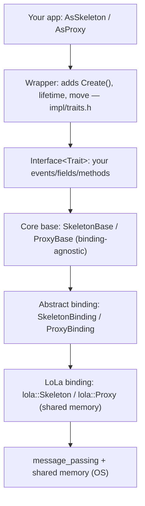
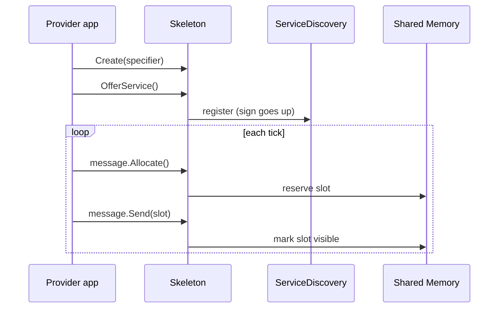
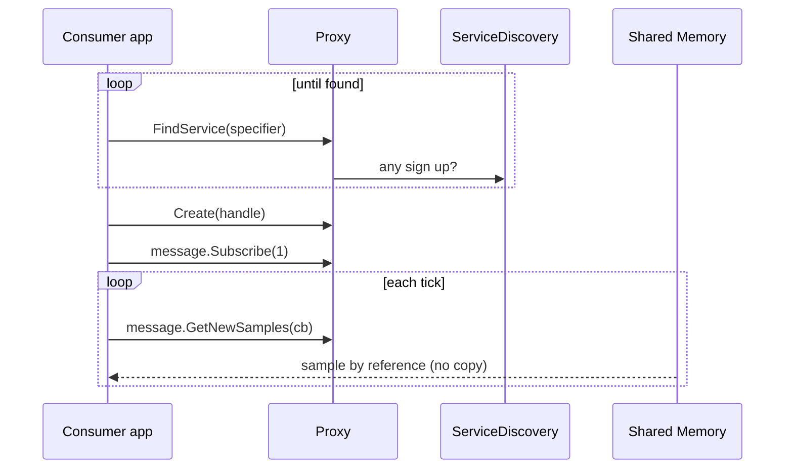
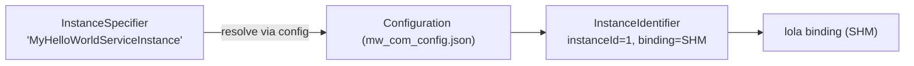

<!--
*******************************************************************************
Copyright (c) 2026 Contributors to the Eclipse Foundation

See the NOTICE file(s) distributed with this work for additional
information regarding copyright ownership.

This program and the accompanying materials are made available under the
terms of the Apache License Version 2.0 which is available at
https://www.apache.org/licenses/LICENSE-2.0

SPDX-License-Identifier: Apache-2.0
*******************************************************************************
-->

# LoLa Mental Model, ELI10 & Revision Notes

Companion to [README.md](README.md). This file is for **fast recall**: the "explain like I'm
10" story, pictures, and one-line facts you can revise before a review. Every fact links to
the proof in code.

---

## Part A — Explain Like I'm 10 🧒

### The lemonade stand story

Imagine two kids: **Provider** has a lemonade stand, and **Consumer** wants lemonade.

1. **A shared table (shared memory).** Instead of Provider running lemonade over to Consumer
   every time (slow, spills = copying), they put a **table between their two windows**. Provider
   puts a cup on the table; Consumer just reaches over and drinks. Nobody carries anything far.
   That table is **shared memory**, and "not carrying" is **zero-copy**.
   👉 Proof the data pointers live in shared memory:
   [impl/plumbing/sample_ptr.h](../../impl/plumbing/sample_ptr.h),
   [impl/plumbing/sample_allocatee_ptr.h](../../impl/plumbing/sample_allocatee_ptr.h).

2. **A sign-up sheet (service discovery).** Consumer doesn't know if the stand is open. So
   Provider hangs a sign that says "Lemonade here!" (**OfferService**). Consumer keeps checking
   for the sign (**FindService**). When the sign appears, they get connected.
   👉 Proof: `OfferService` [impl/skeleton_base.h#L74](../../impl/skeleton_base.h#L74);
   `FindService` [impl/proxy_base.h#L55-L66](../../impl/proxy_base.h#L55-L66).

3. **A phone book (config file).** How do both kids agree they mean the *same* stand? A shared
   phone book maps the nickname "MyHelloWorldServiceInstance" to a real address and rules
   (how many cups fit on the table = slots).
   👉 Proof: [doc/tutorial/chapter_1/mw_com_config.json](../tutorial/chapter_1/mw_com_config.json).

4. **Cups with tickets (reference counting).** Many friends might drink from the same cup.
   The table won't take a cup away until *everybody* is done holding it. LoLa counts who's
   holding each slot so it never reuses one too early.
   👉 Proof: [impl/sample_reference_tracker.h](../../impl/sample_reference_tracker.h).

5. **One kid can wear two hats (traits).** The *very same* recipe card (`HelloWorldInterface`)
   can be worn as a "seller hat" (**Skeleton**, can Send) or a "buyer hat" (**Proxy**, can
   Receive). You pick the hat with a *trait*.
   👉 Proof: [impl/traits.h#L145-L179](../../impl/traits.h#L145-L179).

### Why is it built this way? (the "why" for a curious kid)
- **Why shared memory instead of carrying?** Speed. Cars need answers in microseconds; copying
  big data between programs is too slow.
- **Why an abstract "binding" in the middle?** So you can *pretend* (fake binding) during tests
  and *swap* the transport later (e.g., talk to another computer with SomeIP) without rewriting
  your app. 👉 `kFake`, `kSomeIp` in [impl/binding_type.h](../../impl/binding_type.h).
- **Why a phone-book config file?** So the *same program* can be deployed differently without
  recompiling — the names stay, the wiring changes.
- **Why one Runtime singleton?** One program has one deployment and one view of who's out
  there; everyone shares that single brain. 👉 [impl/runtime.h](../../impl/runtime.h).

---

## Part B — The mental model in 5 pictures

### 1. The layer cake (top = your code, bottom = the wire)

Proof of each layer is in [README.md §3](README.md#3-module-by-module-tour-what-each-folderclass-is-for).

### 2. The inheritance trick
`obj.OfferService()` and `obj.message` work on ONE object because:
```
SkeletonWrapperClass  →  HelloWorldInterface<SkeletonTrait>  →  SkeletonBase
   (Create, move)            (member: message)                   (OfferService)
```
Proof: [impl/traits.h#L183](../../impl/traits.h#L183),
[impl/skeleton_base.h#L74](../../impl/skeleton_base.h#L74).

### 3. The provider timeline

Proof: [doc/tutorial/chapter_1/provider.cpp](../tutorial/chapter_1/provider.cpp).

### 4. The consumer timeline

Proof: [doc/tutorial/chapter_1/consumer.cpp](../tutorial/chapter_1/consumer.cpp).

### 5. Name → identity → binding

Proof: [impl/configuration/configuration.h](../../impl/configuration/configuration.h),
config [doc/tutorial/chapter_1/mw_com_config.json](../tutorial/chapter_1/mw_com_config.json).

---

## Part C — Revision notes (one-liners with proof)

**Public API**
- `types.h` is the single public header; everything else is `impl`. → [types.h](../../types.h)
- `AsSkeleton<I>` = server type; `AsProxy<I>` = client type. → [types.h#L120-L130](../../types.h#L120-L130)
- `WithGetter/WithSetter/WithNotifier` are field feature tags. → [types.h#L106-L118](../../types.h#L106-L118)

**Interface & traits**
- Interface is templated on `Trait`; `Trait::Base`/`Trait::Event` decide personality. → [impl/traits.h#L145-L179](../../impl/traits.h#L145-L179)
- `SkeletonTrait::Base = SkeletonBase`, `Event = SkeletonEvent`. → [impl/traits.h#L163-L172](../../impl/traits.h#L163-L172)
- Wrapper inherits the interface and adds static `Create()`. → [impl/traits.h#L183-L253](../../impl/traits.h#L183-L253)

**Provider (skeleton)**
- `OfferService()` / `StopOfferService()` live on `SkeletonBase`. → [impl/skeleton_base.h#L74-L82](../../impl/skeleton_base.h#L74-L82)
- Skeleton owns `binding_` + maps of events/fields/methods. → [impl/skeleton_base.h#L44-L46](../../impl/skeleton_base.h#L44-L46)
- Send path: `Allocate()` → fill → `Send()`. → [impl/bindings/lola/skeleton_event.h](../../impl/bindings/lola/skeleton_event.h)

**Consumer (proxy)**
- `FindService` (sync) & `StartFindService` (async, callback). → [impl/proxy_base.h#L55-L112](../../impl/proxy_base.h#L55-L112)
- `Subscribe(n)` reserves n slots; `GetNewSamples(cb, n)` delivers by reference. → [impl/proxy_event_base.h#L60-L73](../../impl/proxy_event_base.h#L60-L73)

**Discovery**
- `IServiceDiscovery` = Offer/StopOffer/Find/StartFind. → [impl/i_service_discovery.h](../../impl/i_service_discovery.h)
- Delegates to binding-specific `IServiceDiscoveryClient`. → [impl/service_discovery.cpp](../../impl/service_discovery.cpp)
- Handles: `FindServiceHandle` (search token), `HandleType` (instance handle). → [impl/find_service_handle.h](../../impl/find_service_handle.h), [impl/handle_type.h](../../impl/handle_type.h)

**Identity / config**
- `InstanceSpecifier` = design name; `InstanceIdentifier` = deployment identity. → [impl/instance_specifier.h](../../impl/instance_specifier.h), [impl/instance_identifier.h](../../impl/instance_identifier.h)
- `Configuration` parses `mw_com_config.json`. → [impl/configuration/configuration.h](../../impl/configuration/configuration.h)

**Bindings & memory**
- `BindingType`: `kLoLa`, `kFake`, `kSomeIp`. → [impl/binding_type.h](../../impl/binding_type.h)
- Abstract `SkeletonBinding` / `ProxyBinding`; real work in `bindings/lola/`. → [impl/skeleton_binding.h](../../impl/skeleton_binding.h), [impl/proxy_binding.h](../../impl/proxy_binding.h)
- Zero-copy pointers: `SampleAllocateePtr` (send) / `SamplePtr` (receive). → [impl/plumbing/sample_allocatee_ptr.h](../../impl/plumbing/sample_allocatee_ptr.h), [impl/plumbing/sample_ptr.h](../../impl/plumbing/sample_ptr.h)
- Slots freed only when ref count hits zero. → [impl/sample_reference_tracker.h](../../impl/sample_reference_tracker.h)

**Runtime**
- Singleton owning config, discovery, per-binding runtimes, tracing. → [impl/runtime.h](../../impl/runtime.h)
- Reached via `Runtime::getInstance()`. → [impl/proxy_base.cpp](../../impl/proxy_base.cpp)

---

## Part D — Glossary (fast lookup)

| Term | Kid word | Real meaning | Proof |
|------|----------|--------------|-------|
| Skeleton | Seller | Provider-side object that offers a service | [impl/skeleton_base.h](../../impl/skeleton_base.h) |
| Proxy | Buyer | Consumer-side object that uses a service | [impl/proxy_base.h](../../impl/proxy_base.h) |
| Event | A shout | One-way data stream (publish/subscribe) | [impl/skeleton_event_base.h](../../impl/skeleton_event_base.h) |
| Field | A whiteboard value | Value with get/set/notify | [impl/skeleton_field_base.h](../../impl/skeleton_field_base.h) |
| Method | A request | Call-and-answer (RPC) | [impl/methods/](../../impl/methods/) |
| Binding | The delivery truck | Transport implementation | [impl/binding_type.h](../../impl/binding_type.h) |
| Sample | A cup of data | One data item in a slot | [impl/plumbing/sample_ptr.h](../../impl/plumbing/sample_ptr.h) |
| Slot | A spot on the table | Shared-memory buffer for one sample | [impl/sample_reference_tracker.h](../../impl/sample_reference_tracker.h) |
| InstanceSpecifier | Nickname | Design-time port name | [impl/instance_specifier.h](../../impl/instance_specifier.h) |
| InstanceIdentifier | Real address | Deployment-time identity | [impl/instance_identifier.h](../../impl/instance_identifier.h) |
| Runtime | The brain | Process singleton | [impl/runtime.h](../../impl/runtime.h) |

---

## Part E — 60-second self-test (can you answer these?)
1. Why can one interface become both a proxy and a skeleton? *(traits)* → [impl/traits.h](../../impl/traits.h)
2. Why does the skeleton object have both `OfferService()` and `message`? *(inheritance chain)* → [impl/traits.h#L183](../../impl/traits.h#L183)
3. What maps `"MyHelloWorldServiceInstance"` to an actual SHM instance? *(config)* → [mw_com_config.json](../tutorial/chapter_1/mw_com_config.json)
4. What makes the data transfer zero-copy? *(shared memory + sample pointers)* → [impl/plumbing/sample_ptr.h](../../impl/plumbing/sample_ptr.h)
5. Why is there an abstract binding layer? *(testability + future transports)* → [impl/binding_type.h](../../impl/binding_type.h)

If you can answer all five with the proof link, you understand LoLa's core. ✅
