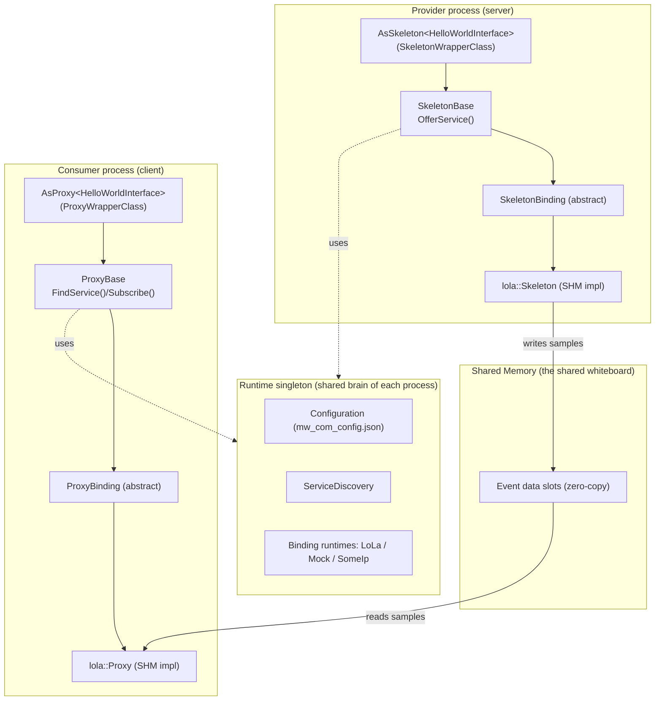
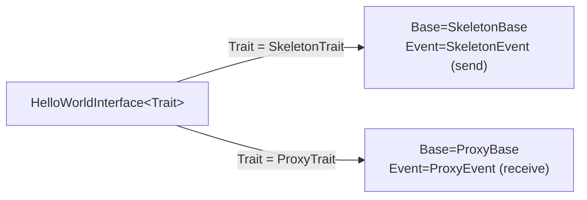
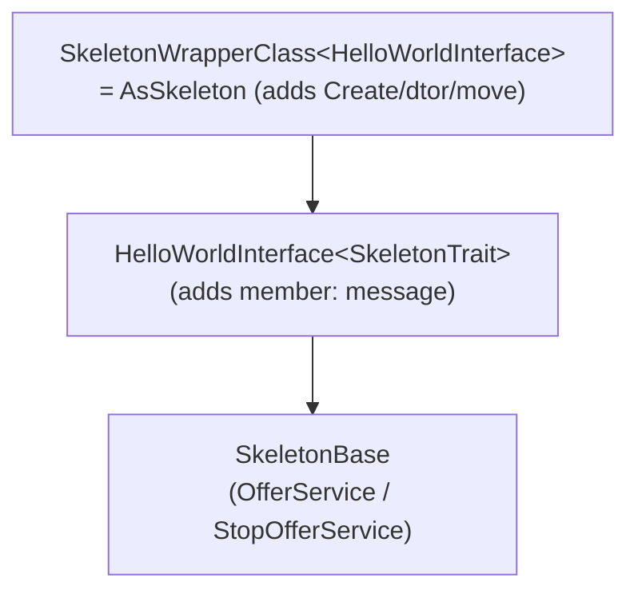

<!--
*******************************************************************************
Copyright (c) 2026 Contributors to the Eclipse Foundation

See the NOTICE file(s) distributed with this work for additional
information regarding copyright ownership.

This program and the accompanying materials are made available under the
terms of the Apache License Version 2.0 which is available at
https://www.apache.org/licenses/LICENSE-2.0

SPDX-License-Identifier: Apache-2.0
*******************************************************************************
-->

# LoLa (`mw::com`) — One‑Stop Onboarding Guide

> 👋 **New here? Read this box first — it's the whole map.**
>
> This folder teaches you the **LoLa** communication library from zero. There are **4 files**.
> Here's exactly what each is and the order to use them:
>
> | # | File | What it is | When to read |
> |---|------|-----------|--------------|
> | 1 | **README.md** (this file) | The big picture in plain words + the map | **Read this first, once, top to bottom** |
> | 2 | **[LINE_BY_LINE_PLAN.md](LINE_BY_LINE_PLAN.md)** | 👈 **Your main guide.** A 10‑day, step‑by‑step plan: open this file → read these lines → do next. Starts with a "Day 0" that teaches the basic words. | **Start Day 0 after this README** |
> | 3 | **[MENTAL_MODEL.md](MENTAL_MODEL.md)** | Kid‑simple stories + revision notes + diagrams | Peek whenever you're confused or want to revise |
> | 4 | **[API_DEEP_DIVE.md](API_DEEP_DIVE.md)** | "What exactly happens when I call this function," with diagrams | The plan links you here on Days 4, 5, 8 |
>
> **So your path is simple:** finish this README → open LINE_BY_LINE_PLAN.md → do Day 0, then
> Day 1, Day 2… in order. The other two files are helpers you open only when told to.
>
> Don't worry if words below (like "shared memory" or "AUTOSAR") are new — **Day 0 of the plan
> explains every basic word.** This README is just the friendly overview.

---

## 0. What is this thing, in one breath?

LoLa (**Lo**w **La**tency) is a library that lets **two programs on the same machine talk to
each other really fast**, by putting the data in a piece of memory that both programs can see
at the same time (**shared memory**), so nothing has to be copied. It follows the
**Adaptive AUTOSAR `ara::com`** style: a **provider** (server) *offers* a service, and a
**consumer** (client) *finds* and *subscribes* to it.

- The public front door is one header: [score/mw/com/types.h](../../types.h)
- The provider object type is `AsSkeleton<Interface>`; the consumer type is `AsProxy<Interface>`
  ([types.h#L120-L130](../../types.h#L120-L130)).

---

## 1. The 10,000-foot picture



**The three big ideas you must hold in your head:**

1. **Interface → trait → wrapper.** You write *one* interface template. LoLa reinterprets it
   as either a proxy or a skeleton using a "trait" (compile-time plug). Proof:
   [impl/traits.h](../../impl/traits.h) — `SkeletonTrait` / `ProxyTrait` and the
   `SkeletonWrapperClass` / `ProxyWrapperClass`.
2. **Binding-agnostic core + swappable binding.** The middle layers (`SkeletonBase`,
   `ProxyBase`) know *nothing* about shared memory. They talk to an abstract `SkeletonBinding`
   / `ProxyBinding`. The real SHM work happens in `bindings/lola/`. This is why the same code
   can run on a mock/fake binding in tests. Proof: [impl/binding_type.h](../../impl/binding_type.h),
   [impl/skeleton_binding.h](../../impl/skeleton_binding.h), [impl/proxy_binding.h](../../impl/proxy_binding.h).
3. **Zero-copy via shared memory.** Data is written *once* into a shared slot and read
   directly by consumers. No `memcpy` across processes. Proof:
   [impl/plumbing/sample_allocatee_ptr.h](../../impl/plumbing/sample_allocatee_ptr.h) (sender),
   [impl/plumbing/sample_ptr.h](../../impl/plumbing/sample_ptr.h) (receiver).

---

## 2. The end-to-end flow, following real tutorial code

The best way to learn is to trace the working example in
[doc/tutorial/chapter_1](../tutorial/chapter_1). There is a **provider** and a **consumer**,
and a **config file** that glues them together.

### 2a. The service interface (written once, used by both sides)

[doc/tutorial/chapter_1/hello_world_service.h#L20-L28](../tutorial/chapter_1/hello_world_service.h#L20-L28):

```cpp
template <typename Trait>
class HelloWorldInterface : public Trait::Base
{
  public:
    using Trait::Base::Base;
    using FixedSizeString = std::array<char, 255>;
    typename Trait::template Event<FixedSizeString> message{*this, "message"};
};
```

- **Why templated on `Trait`?** So the *same* class can become a server or a client. When
  `Trait = SkeletonTrait`, `message` becomes a `SkeletonEvent` (can send). When
  `Trait = ProxyTrait`, `message` becomes a `ProxyEvent` (can receive). Proof:
  [impl/traits.h#L163-L179](../../impl/traits.h#L163-L179) (`SkeletonTrait` maps
  `Base → SkeletonBase`, `Event → SkeletonEvent`).

### 2b. Provider side (server) — offer + send

[doc/tutorial/chapter_1/provider.cpp](../tutorial/chapter_1/provider.cpp):

```cpp
using HelloWorldSkeleton = score::mw::com::AsSkeleton<score::mw::com::tutorial::HelloWorldInterface>;

auto instance_specifier = score::mw::com::InstanceSpecifier::Create(std::string{"MyHelloWorldServiceInstance"});
auto result = HelloWorldSkeleton::Create(instance_specifier.value());   // 1. create
auto instance = std::move(result).value();
instance.OfferService();                                                // 2. offer

auto slot = instance.message.Allocate();                                // 3. get a shared slot
std::memcpy(slot.value().Get()->data(), ...);                           // 4. fill it (zero-copy)
instance.message.Send(std::move(slot.value()));                         // 5. publish
```

Line-by-line proof:

| Step | What happens | Proof |
|------|--------------|-------|
| `Create` | Resolves specifier→identifier, builds the binding, validates it | [impl/traits.h#L200-L253](../../impl/traits.h#L200-L253) |
| `OfferService` | Registers with the binding + service discovery | [impl/skeleton_base.h#L74](../../impl/skeleton_base.h#L74), [impl/skeleton_base.cpp](../../impl/skeleton_base.cpp) |
| `message` member | It's a `SkeletonEvent<FixedSizeString>` inherited from the interface | [impl/traits.h#L169-L172](../../impl/traits.h#L169-L172) |
| `Allocate` | Gives you a `SampleAllocateePtr` into a shared-memory slot | [impl/bindings/lola/skeleton_event.h](../../impl/bindings/lola/skeleton_event.h) |
| `Send` | Marks the slot visible to consumers | [impl/bindings/lola/skeleton_event.h](../../impl/bindings/lola/skeleton_event.h) |

> **Why does `instance` have both `OfferService()` and `message`?** Because of inheritance:
> `SkeletonWrapperClass → HelloWorldInterface<SkeletonTrait> → SkeletonBase`. `OfferService`
> lives on `SkeletonBase`; `message` is a data member of the interface. See
> [MENTAL_MODEL.md](MENTAL_MODEL.md#the-inheritance-trick) for the picture.

### 2c. Consumer side (client) — find + subscribe + receive

[doc/tutorial/chapter_1/consumer.cpp](../tutorial/chapter_1/consumer.cpp):

```cpp
using HelloWorldProxy = score::mw::com::AsProxy<score::mw::com::tutorial::HelloWorldInterface>;

auto handles = HelloWorldProxy::FindService(instance_specifier.value());   // 1. discover
auto proxy   = HelloWorldProxy::Create(handles.value()[0]).value();        // 2. connect
proxy.message.Subscribe(1);                                                // 3. subscribe
proxy.message.GetNewSamples([](auto&& sample){                            // 4. receive
    const auto* buf = sample.Get()->data();
}, 1);
```

| Step | What happens | Proof |
|------|--------------|-------|
| `FindService` | Synchronous discovery; returns handles for available instances | [impl/proxy_base.h#L55-L66](../../impl/proxy_base.h#L55-L66), [impl/proxy_base.cpp](../../impl/proxy_base.cpp) |
| `Create(handle)` | Builds a proxy bound to a discovered instance | [impl/traits.h](../../impl/traits.h) (`ProxyWrapperClass::Create`) |
| `Subscribe(1)` | Reserves 1 sample slot for this consumer | [impl/proxy_event_base.h#L60-L66](../../impl/proxy_event_base.h#L60-L66) |
| `GetNewSamples` | Delivers received samples by reference (zero-copy) | [impl/bindings/lola/proxy_event.h](../../impl/bindings/lola/proxy_event.h) |

### 2d. The glue: the config file

`FindService` can only match provider and consumer because both read the **same config**.
[doc/tutorial/chapter_1/mw_com_config.json](../tutorial/chapter_1/mw_com_config.json):

```jsonc
"serviceInstances": [{
  "instanceSpecifier": "MyHelloWorldServiceInstance",   // the human name both sides use
  "serviceTypeName": "/score/mw/com/tutorial/HelloWorldService",
  "instances": [{
    "instanceId": 1, "asil-level": "QM", "binding": "SHM",
    "events": [{ "eventName": "message", "numberOfSampleSlots": 10, "maxSubscribers": 3 }]
  }]
}]
```

- `instanceSpecifier` is the **design-time name** you pass to `InstanceSpecifier::Create(...)`.
- The config maps it to an `instanceId` + binding (`SHM` = LoLa) + how many slots/subscribers.
- This mapping (specifier → identifier) is exactly what `ResolveInstanceIDs` / `GetInstanceIdentifier`
  does. Proof: [runtime.h](../../runtime.h) `ResolveInstanceIDs`, and `GetInstanceIdentifier`
  declared in [impl/skeleton_base.h](../../impl/skeleton_base.h) (bottom of file).

---

## 3. Module-by-module tour (what each folder/class is for)

### 3.1 Public API layer — `score/mw/com/`
The only headers a user should include.

| File | Role | Proof |
|------|------|-------|
| [types.h](../../types.h) | Exports every user-facing alias: `InstanceSpecifier`, `HandleType`, `AsProxy`, `AsSkeleton`, `SamplePtr`, `SampleAllocateePtr`, field tags `WithGetter/WithSetter/WithNotifier`, `GenericProxy/Skeleton` | [types.h#L44-L160](../../types.h#L44-L160) |
| [runtime.h](../../runtime.h) | Process-level init and `ResolveInstanceIDs` | [runtime.h](../../runtime.h) |
| [types.h](../../types.h) | `AsSkeleton = impl::AsSkeleton<T>` | [types.h#L130](../../types.h#L130) |

### 3.2 Runtime (the "brain" of each process) — `impl/runtime.*`, `impl/i_runtime.h`
A singleton that owns configuration, service discovery, per-binding runtimes, and tracing.

- Singleton access + init. Proof: [impl/runtime.h](../../impl/runtime.h) (`getInstance()`, `Initialize()`).
- Holds `Configuration`, `ServiceDiscovery`, a map of `IBindingRuntime` per `BindingType`, and a
  tracing runtime. Proof: member list in [impl/runtime.h](../../impl/runtime.h).
- **Why a singleton?** One process = one deployment config = one discovery view. Everything
  (proxies, skeletons) reaches it through `Runtime::getInstance()`. Proof:
  [impl/proxy_base.cpp](../../impl/proxy_base.cpp) calls `Runtime::getInstance().GetServiceDiscovery()`.

### 3.3 Skeleton (provider) core — `impl/skeleton_*`
Binding-agnostic server logic.

| Class | Role | Proof |
|-------|------|-------|
| `SkeletonBase` | Owns the binding + maps of events/fields/methods; implements `OfferService`/`StopOfferService` | [impl/skeleton_base.h](../../impl/skeleton_base.h) |
| `SkeletonEventBase` | One event on the server side; `PrepareOffer()` sets it up | [impl/skeleton_event_base.h](../../impl/skeleton_event_base.h) |
| `SkeletonFieldBase` | A field = event + optional getter/setter | [impl/skeleton_field_base.h](../../impl/skeleton_field_base.h) |
| `GenericSkeleton` | Type-erased skeleton (offer without knowing the C++ type) | [impl/generic_skeleton.h](../../impl/generic_skeleton.h) |

### 3.4 Proxy (consumer) core — `impl/proxy_*`
Binding-agnostic client logic.

| Class | Role | Proof |
|-------|------|-------|
| `ProxyBase` | `FindService` / `StartFindService` / `StopFindService`, holds handle+binding | [impl/proxy_base.h#L55-L112](../../impl/proxy_base.h#L55-L112) |
| `ProxyEventBase` | `Subscribe`, `GetSubscriptionState`, receive plumbing | [impl/proxy_event_base.h#L60-L73](../../impl/proxy_event_base.h#L60-L73) |
| `ProxyFieldBase` | Field on the consumer: event + get/set method dispatchers | [impl/proxy_field_base.h](../../impl/proxy_field_base.h) |
| `GenericProxy` | Type-erased proxy | [impl/generic_proxy.h](../../impl/generic_proxy.h) |

### 3.5 Service discovery — `impl/service_discovery*`, `impl/find_service_*`, `impl/handle_type.h`
Matches providers to consumers.

| Item | Role | Proof |
|------|------|-------|
| `IServiceDiscovery` | Interface: `OfferService`, `StopOfferService`, `StartFindService`, `FindService` | [impl/i_service_discovery.h](../../impl/i_service_discovery.h) |
| `ServiceDiscovery` | Implementation delegating to binding-specific `IServiceDiscoveryClient` | [impl/service_discovery.cpp](../../impl/service_discovery.cpp) |
| `FindServiceHandle` | Opaque token for an ongoing async search | [impl/find_service_handle.h](../../impl/find_service_handle.h) |
| `FindServiceHandler<T>` | Callback `void(ServiceHandleContainer<T>, FindServiceHandle)` | [impl/find_service_handler.h](../../impl/find_service_handler.h) |
| `HandleType` | Concrete handle to one instance; used by `Proxy::Create` | [impl/handle_type.h](../../impl/handle_type.h) |

- **Cross-process coordination** in LoLa uses flag/lock files on disk under a SHM path.
  Proof: [impl/bindings/lola/shm_path_builder.h](../../impl/bindings/lola/shm_path_builder.h).

### 3.6 Identity & configuration — `impl/instance_*`, `impl/configuration/`
Turns names into deployment identity.

| Item | Role | Proof |
|------|------|-------|
| `InstanceSpecifier` | Design-time port name (`Create("...")`) | [impl/instance_specifier.h](../../impl/instance_specifier.h) |
| `InstanceIdentifier` | Deployment-time identity (from config) | [impl/instance_identifier.h](../../impl/instance_identifier.h) |
| `Configuration` | Parsed `mw_com_config.json`: service types + instances | [impl/configuration/configuration.h](../../impl/configuration/configuration.h) |
| Config parser | Reads the JSON manifest | [impl/configuration/config_parser.h](../../impl/configuration/config_parser.h) |

### 3.7 Bindings & plumbing — `impl/binding_type.h`, `impl/*_binding.h`, `impl/plumbing/`, `impl/bindings/`
The swappable transport.

| Item | Role | Proof |
|------|------|-------|
| `BindingType` | enum `kLoLa`, `kFake`, `kSomeIp` | [impl/binding_type.h](../../impl/binding_type.h) |
| `SkeletonBinding` | Abstract server transport (`PrepareOffer` etc.) | [impl/skeleton_binding.h](../../impl/skeleton_binding.h) |
| `ProxyBinding` | Abstract client transport (`IsEventProvided` etc.) | [impl/proxy_binding.h](../../impl/proxy_binding.h) |
| `lola::Skeleton` / `lola::Proxy` | The real SHM implementation | [impl/bindings/lola/skeleton.h](../../impl/bindings/lola/skeleton.h), [impl/bindings/lola/proxy.h](../../impl/bindings/lola/proxy.h) |
| `plumbing/` | Binding-agnostic smart pointers that hide which binding is active | [impl/plumbing/sample_ptr.h](../../impl/plumbing/sample_ptr.h) |

- **Why the extra abstraction layer?** So tests can run with a fake binding (no shared memory
  needed), and so a future SomeIP (inter-ECU) binding can slot in without touching user code.
  Proof: `BindingType::kFake` + `kSomeIp` exist in [impl/binding_type.h](../../impl/binding_type.h).

### 3.8 Zero-copy sample lifecycle — `impl/sample_*`, `impl/plumbing/`
How memory stays safe without copying.

| Item | Role | Proof |
|------|------|-------|
| `SampleAllocateePtr<T>` | Sender's handle to a slot it is filling | [impl/plumbing/sample_allocatee_ptr.h](../../impl/plumbing/sample_allocatee_ptr.h) |
| `SamplePtr<T>` | Receiver's read-only handle to a slot | [impl/plumbing/sample_ptr.h](../../impl/plumbing/sample_ptr.h) |
| `SampleAllocateeGuard` | RAII: frees the slot if you never send it | [impl/sample_allocatee_guard.h](../../impl/sample_allocatee_guard.h) |
| `SampleReferenceTracker` | Thread-safe counting so a slot isn't reused while read | [impl/sample_reference_tracker.h](../../impl/sample_reference_tracker.h) |

- **Why reference counting?** Multiple consumers may read the same slot at the same time. The
  slot can only be recycled once nobody is holding it. Proof: `TrackerGuardFactory` +
  `SampleReferenceTracker` in [impl/sample_reference_tracker.h](../../impl/sample_reference_tracker.h).

### 3.9 Tracing (optional) — `impl/tracing/`
Records IPC activity for debugging/analysis; off unless configured.

| Item | Role | Proof |
|------|------|-------|
| `ITracingRuntime` | Register elements/SHM objects, `Trace()` calls | [impl/tracing/i_tracing_runtime.h](../../impl/tracing/i_tracing_runtime.h) |

### 3.10 Low-level foundation — `score/message_passing/`
Underneath LoLa there is a generic n-to-1 message-passing layer with OS-specific backends
(POSIX unix domain sockets, QNX dispatch). LoLa uses it for the non-shared-memory signaling
(notifications, discovery). See the module [README.md](../../../../../README.md#2-message-passing-low-level-foundation).

---

## 4. The two "reinterpretation" tricks (the part everyone finds confusing)

### Trick 1 — one interface, two personalities (traits)

Proof: [impl/traits.h#L145-L179](../../impl/traits.h#L145-L179).

### Trick 2 — the wrapper adds `Create()` on top (inheritance)

Proof: `class SkeletonWrapperClass : public Interface<SkeletonTrait>`
[impl/traits.h#L183](../../impl/traits.h#L183); `Create` at
[impl/traits.h#L200](../../impl/traits.h#L200); `OfferService` at
[impl/skeleton_base.h#L74](../../impl/skeleton_base.h#L74).

---

## 5. How to build & run the tutorial

The tutorial has its own Bazel targets. Proof: [doc/tutorial/chapter_1/BUILD](../tutorial/chapter_1/BUILD).
See the tutorial walkthrough [doc/tutorial/chapter_1/README.rst](../tutorial/chapter_1/README.rst)
and the top-level [CONTRIBUTING.md](../../../../../CONTRIBUTING.md) for the exact Bazel commands.

Rough shape (check the BUILD file for exact target names):
```bash
# from repo root
bazel run //score/mw/com/doc/tutorial/chapter_1:provider   # terminal 1
bazel run //score/mw/com/doc/tutorial/chapter_1:consumer   # terminal 2
```

---

## 6. Where to look when you need X

| I want to… | Start here |
|------------|-----------|
| Understand the public API | [types.h](../../types.h) |
| See a full working example | [doc/tutorial/chapter_1](../tutorial/chapter_1) |
| Learn provider offer/send | [impl/skeleton_base.h](../../impl/skeleton_base.h), [impl/bindings/lola/skeleton_event.h](../../impl/bindings/lola/skeleton_event.h) |
| Learn consumer find/subscribe/receive | [impl/proxy_base.h](../../impl/proxy_base.h), [impl/proxy_event_base.h](../../impl/proxy_event_base.h) |
| Understand discovery | [impl/service_discovery.cpp](../../impl/service_discovery.cpp) |
| Understand config mapping | [impl/configuration/configuration.h](../../impl/configuration/configuration.h) |
| Understand zero-copy memory | [impl/plumbing/sample_ptr.h](../../impl/plumbing/sample_ptr.h), [impl/sample_reference_tracker.h](../../impl/sample_reference_tracker.h) |
| Understand the trait/wrapper magic | [impl/traits.h](../../impl/traits.h) |
| Read the design docs | [design/](../../design/) |

---

Next: read [MENTAL_MODEL.md](MENTAL_MODEL.md) for the kid-friendly explanation, quick-recall
diagrams, and revision notes — then follow [LINE_BY_LINE_PLAN.md](LINE_BY_LINE_PLAN.md) to
work through everything day by day, step by step.
